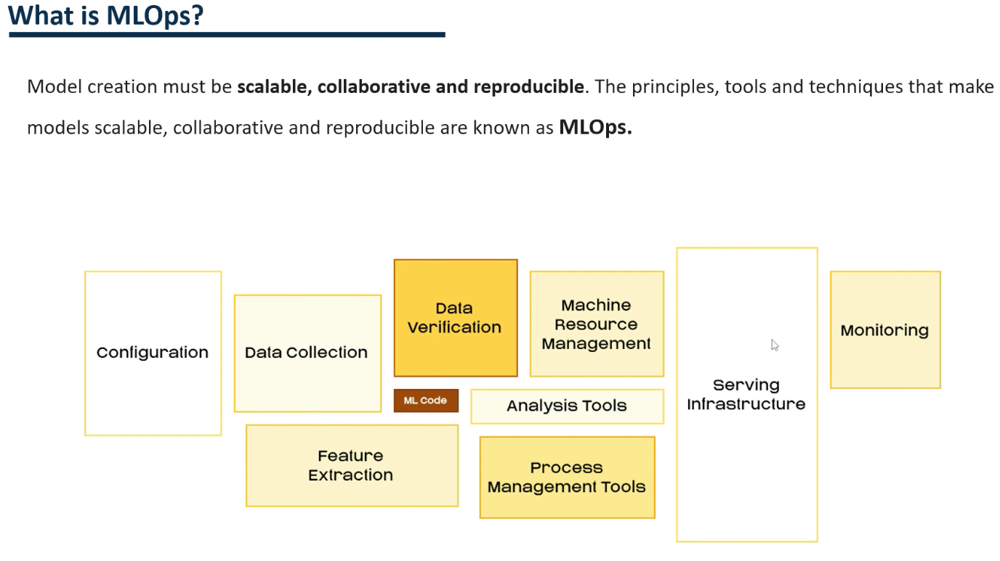
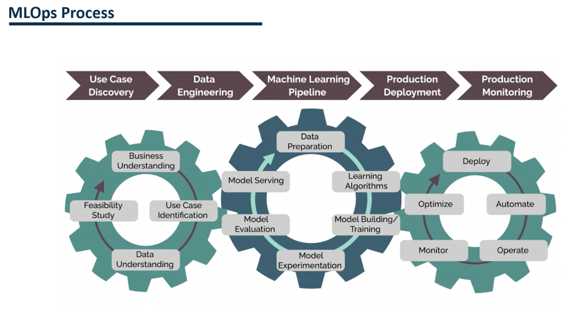

#### What is MLOPs?
  
  
In the traditional view of model development, we only focused on model training. With the MLOPs, other components such as data collection, variable transformation, data validation, model management or service infrastructure have more importance.   

#### MLOPs Process
  

Developing a model using MLOPs follows this process.  
  
It has 5 main parts.  
  
The first one is the discovery of use cases. It means discovering the most critical aspects of the business and identifying its needs.  
Then there would be data engineering, pipeline development, production, startup and monitoring.  
  
These five phases are composed of different sub-parts.  
  
For example, in the use case discovery, we have business understanding which seeks to understand the  needs of the business.  
The use case identification seeks to identify different ways to solve the needs of the business.  
Data Understanding analyzes the available data and identifies what other data needs to be collected.  
The part of the feasibility study where it is determined if with the data you have, it is possible to develop the models.  
  
Then we would move on to the part that is most commonly known as Model Development.  
Here, the data is transformed and cleaned.  
Different algorithms are trained and the best algorithm is identified and optimized.  
Then its performance is evaluated and finally put into production.  
  
In the last phase, we would put the model into production.  
To do this, we would have to automate the deployment of the model.  
  
We would also have to monitor the performance of the model. If it starts to give worse results, we could retrain it and redeploy it.  