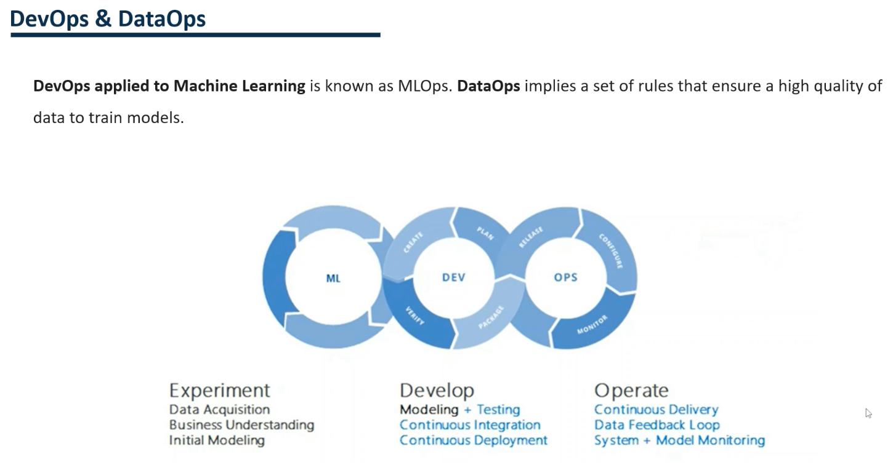
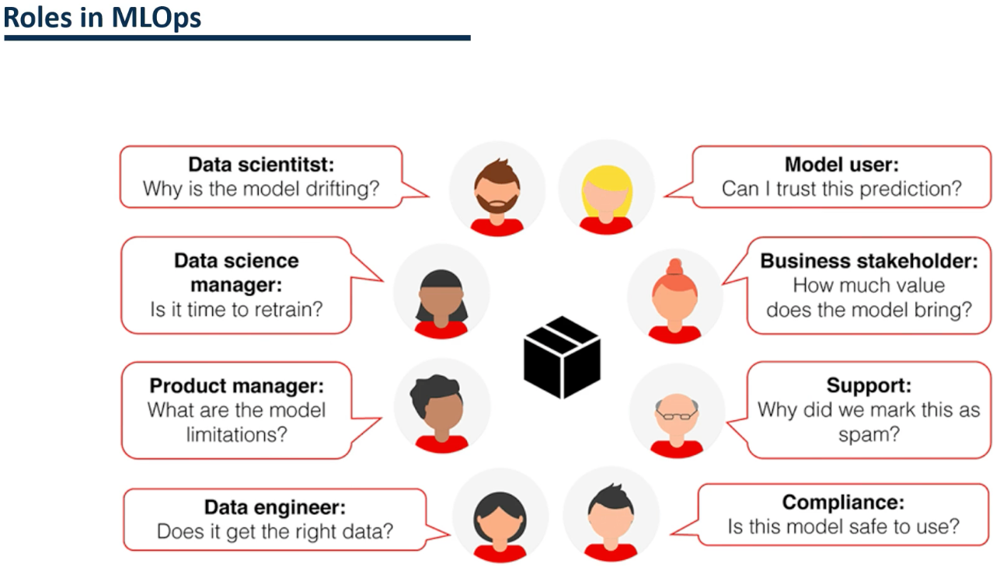

### DevOps and DataOps
DevOps is an iterative approach to deploying software applications in production, and MLOps borrows the same principles from DevOps by applying them to machine learning and ML.  
  
MLOps allows machine learning models to be brought to production iteratively.   
Whether it's DevOps or MLOps, the ultimate goal is the same - greater quality and control of software applications and machine learning models sent to production.  
  
Not only have we applied the term DevOps to machine learning, but we have also applied it to data.  
  
The DevOps applied to the data is what is known as DataOps.  
DataOps involves a set of rules that ensure the availability of high quality data for model training.  
  
  
  
On the one hand, we have the part of machine learning.  
In this part, we not only develop the different models, but also the acquisition of data, understanding business needs and developing initial models.  
  
Then we would have the DevOps part.  This part applies continuous testing, integration and development.  
Continuous integration and continuous deployment are practices for automating integration and deployment.  
  
Let's say we have completed the development of our machine learning model and have all our code in a version control repository because we work as a team, many people work on different parts of the code.  
We must integrate all changes somehow and implement the latest code in all our development and production environments.  
It is when we apply continuous integration and continuous deployment.  
  
Finally, we would have the part of ops related to operate.  
In this part, we have the continuous delivery, the data feedback loop and the monitoring of the model.  
  
The data feedback loop helps the model learn from its mistakes by returning incorrectly predicted data.  
Without this, a machine learning model tends to worsen its metrics over time, as it does not adapt to changes in the data.  
  
As for monitoring, it is just as important in software development as it is in data science.  
We need to monitor the model to keep users satisfied constantly.  
  
### Roles in MLOps
  
  
When we applied all the MLOPs methodologies, we went from having a single role, which would be the data scientist to have many more roles with MOPS.  
  
The data scientist would worry about training the model and knowing why the model is not giving good results.  
  
Then we would have the data science manager.  
He is in charge of evaluating if it is time to retrain the model or if it needs additional changes.  
  
The product manager is responsible for identifying the customer's needs and publicizing the model's limitations.  
  
The data engineer is responsible for obtaining the data from different sources, extracting them and correcting them.  
  
Then we would have the quality manager (Compliance).   
The quality manager is the one who makes sure that the model we are using is suitable and safe.  
  
The support part is responsible for helping the business to apply this model.   
  
The business stakeholder is responsible for valuing the model in the company.  
  
Finally, the user utilizes the model to obtain predictions.  
Also, he will compare the model's results with his knowledge of the business to know if it is reliable.  