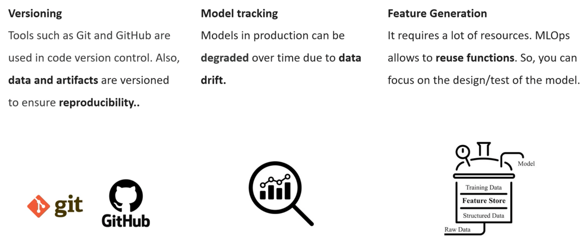

## Challenges addressed by MLOps

#### Versioning
The tools and techniques defined in MLOps make data scientists work easier.  
On the one hand, it addresses the issue of versioning.  
Version control is common in software engineering with tools like GitHub or Git.  
In addition to code control, you must control other things like model data and artifacts.  
Model and data versioning ensures that experiments are reproducible, and we can replicate the same results across different iterations.  
  

#### Model Tracking
Another problem it solves is the monitoring of the performance of the model models, and production can degrade over time.  
It is due to the differences between training data and test data.  
It is known as Data Drift.  
If we monitor the performance of a model, we can identify and solve those problems.  
  

#### Feature Generation / Feature Engineering
Finally, the last problem that ML solves is that of feature engineering.  
Feature engineering can be a time-consuming task and computing resources.  
The MLOps application allows functions to be generated only once and can be used as many times as needed.  
It frees up the data scientists to focus on designing and testing the model.  