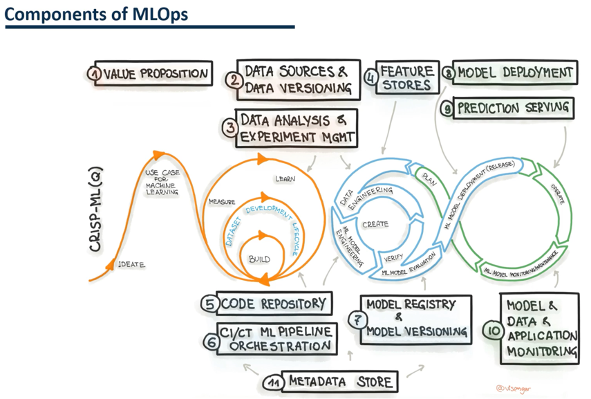

## Parts of MLOps

Here we can see where each of the parts of MLOps is located.  
We start with the value proposition, then data versioning, data analysis and experimentation, code repository, pipeline orchestration, model registration and versioning, production deployment, model serving and finally model and application monitoring.  
  
In the value proposition, we will identify different machine learning use cases.   
Then we identify the available data sources, analyze them version, and register the data sets.  
Once we have done this, we move on to the development and training of the model.  
Here, the feature stores are generated, the model is registered and versioned and the metadata is stored.  
Finally, the application is generated and monitored in the production startup part.  
  

  
  
Even though the ML ops field is quite broad, we will look at the most critical parts.    

#### Feature Store
The feature store is a critical part of ML ops.  
We must _store_ the functions used in the training of a model.  
Ensures that there is no duplication in the creation of functions.  
Features can also be searched and used to build other models or analyze the data.  
Functions are also _versioned_.  
It ensures that you can revert to a previous version of the feature.  
  
#### Data Versioning
Data versioning ensures reproducibility in model creation.  
In addition to functions, you can also store the data set used to train a model.  
It is also essential during the audit to identify the data sets used.    

#### Metadata Store
Another essential part is the metadata store.  
In machine learning, it is vital to store the configuration and metadata of the model.  
It is essential to increase reproducibility.  
Some artifacts that we have to record is the random seed used to split the data.  
We can store other metadata, for example, model evaluation metrics, hyper parameters or configuration files.    

#### Model Versioning
Model version control is vital because it lets you switch between models in real time.  
Apart from that, multiple models can be used to monitor performance.  
Version control is also critical from the governance point of view of model and compliance.    

#### Model Registration
Model registration should not be mistaken for model versioning.  
Once we have trained the model, we should store it as a new record.  
Each model in the registry will have a version.  
In addition, each model is stored with its hyper parameters, metrics version of functions used and version of the training data set.    

#### Model serving
Once the model is versioned and registered, we will move on to the model service part.    

It is nothing more than deploying the model to serve users.  
When we create model consumption endpoints, we can use those endpoints to get predictions.  
A model container could also integrate an application.  
However, if we want to use the model in several applications simultaneously, it is better to use endpoints with APIs.  
  
Another alternative is to deploy the models on edge devices with tiny machine learning.    

#### Model Monitoring
We should monitor models for possible deviations and biases.  
The deviation occurs when the statistical characteristics between training data and new data change unexpectedly.  
Therefore, the performance of the model degrades.  
We can detect these problems early by monitoring the statistical properties of both training and prediction data.  
In addition, production bias occurs when the deployed model has a different performance than the local model.  
  
Errors can be caused during the training process, service errors or discrepancies in the data.    

#### Model Recycling / Retraining
Another part of ML ops would be model recycling, also known as model retraining.  
Models can be retrained for two reasons.  
The first reason is to improve performance.  
The second reason is when new training data is available.    

#### CI/CD
If we detect newly available data, it should trigger model retraining.  
It is where continuous integration and implementation come in.  
Continuous integration and continuous deployment ensure that models are built and deployed frequently.  
Continuous delivery ensures that code is frequently merged into a central repository where automated builds and tests are applied in machine learning.  
This would involve testing the code and the resulting models.  
  
It also involves creating a container of the models so that users can make use of that model.  
