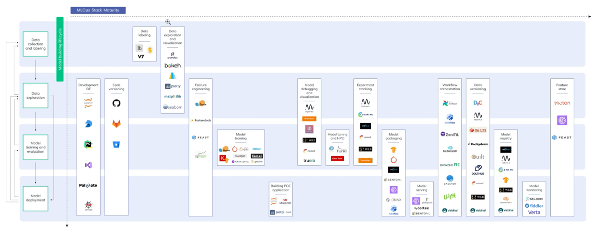

MLOps Toolbox

 
 

We will learn about the essential MLOps libraries in the data exploration and model training part.  

We can use different **Development Tools** such as Jupyter Notebooks, PyCharm or Visual Studio. These are some of the most used.  
Some other libraries are no longer used. For example Spyder.  
  
We will usually use GitHub, GitLab or Bitbucket for the **Versioning of the code**.  
  
For **Data Labeling**, we will use tools such as V7 or Label Box.  
V7 is a powerful automated annotation platform for computer vision.  
V7 combines dataset management, image annotation, video annotation and AutoML model training to complete labeling tasks automatically.  
  
For the **Visualization and Exploration of data**, we can use visualization libraries such as bokeh, matplotlib or Seaborn.  
  
As for **Feature Engineering**, this will depend on the type of model and the programming languages we use.  
Usually we use the scikit-learn Library to perform feature engineering with Python, but we also have other libraries such as the _featuretools_ or the _feast_ library.  
  
Once it is done, we will move on to **Model Training**.  
The conventional libraries for training models are scikit-learn for Machine Learning and TensorFlow and Keras for deep learning.  
  
Once the model is developed, we will move on to **Model Debugging**.  
For this we can use TensorBoard, interpretML or SHAP.
  
  
We would use libraries such as Optima, Tune or KerasTuner to **optimize this model**.  
  
In ML ops, it is vital to **register the models**.  
Therefore, we would go on to perform the Model Track.  
One of the best known and newest book stores is ML Flow, but we also have others like Comet, ClearML and TensorBoard.  
  
Once we have tracked the experiment and the versioning, we will move on to the **Model Packaging**.  
Here we can use Kubeflow, mlflow, ONNX or BentoML.   
ONNX provides an open source format for AI models, both deep learning and traditional ML enabling interoperability between different frameworks.  
  
Once the model was packaged, we would go to model serving.  
**Model serving** seeks to make the model accessible so the user can use it.  
We can use Amazon Sage Maker, FastAPI or BentoML.  
  
Once we have deployed a model in production, we must **orchestrate the workflow**.  
To do this we can use Apache airflow, ZenML or Kubeflow.  
  
For the **monitoring of the model**, we can use Seldon or Verta.  
To ensure that the model continues to work over time, we must monitor it.  
  
As we had mentioned, it is not enough to version the model.  
You also have to version the data.  
The most commonly used library for **data versioning** is DVC.  
We also have the bookstores of Pachyderm, Quilt and Comet, among others.  
  
Finally, we may want to **develop a model for an application process**.  
In this case, we can resort to streamlit or Dash.  
Both tools allow you to create machine learning web applications in Python with few lines of code.  
  
Once this is finished, we also have the option to **develop a POC** of an application.  
It can be developed quickly with a streamlit library, a library specially designed for science and data to generate visual applications with very little code and integrates seamlessly with Python.  

