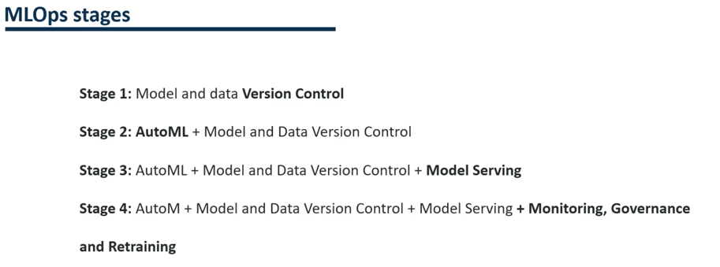
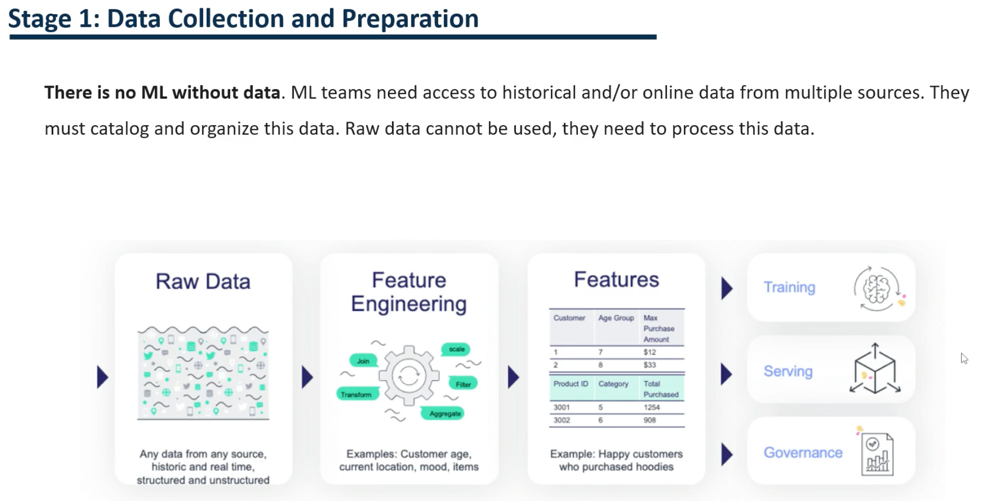
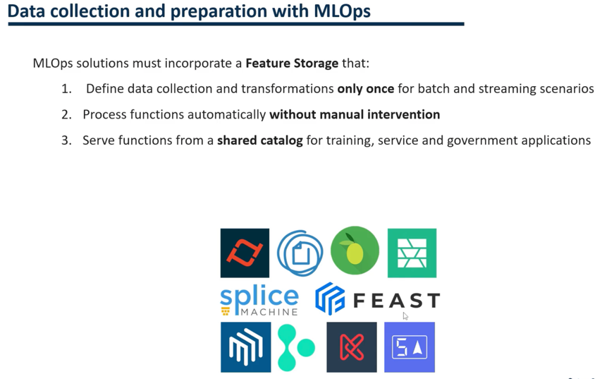
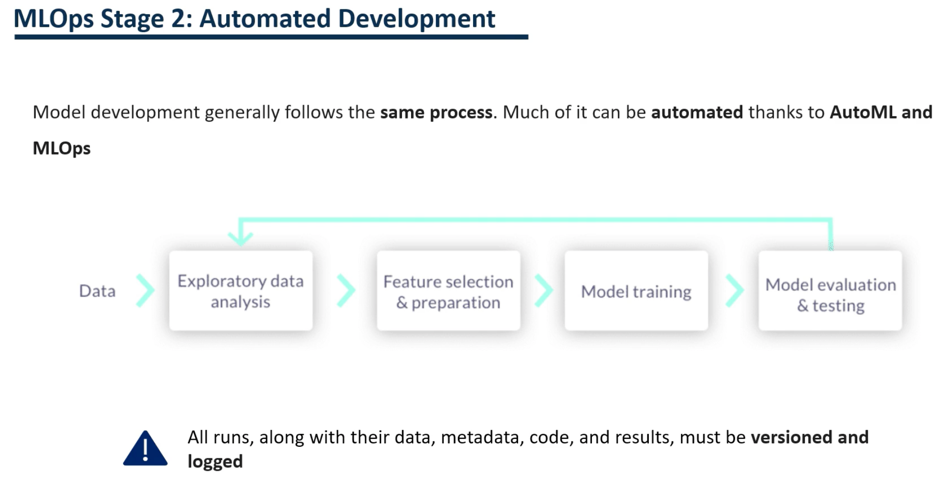
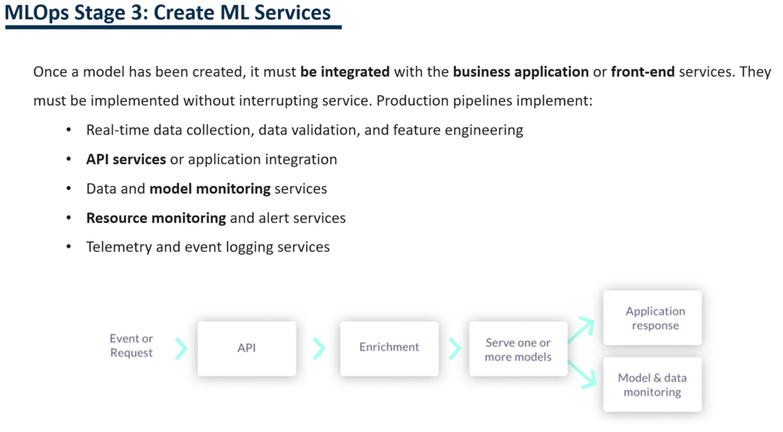
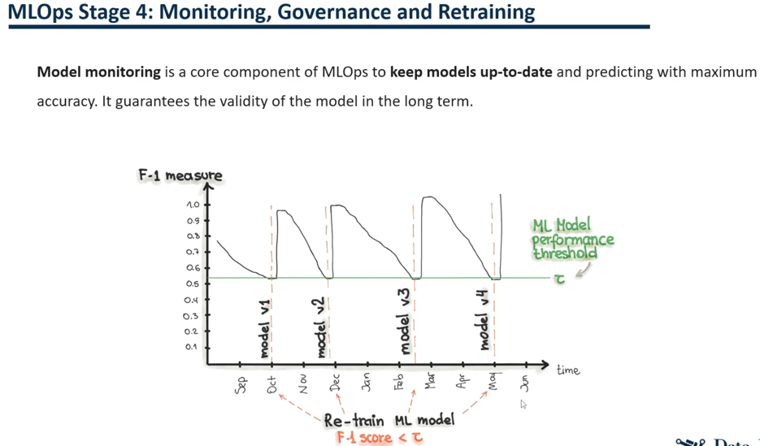

## MLOps Stages
Here we will explain the different stages we must follow to complete the MLW Ops cycle.  
  
 
  
  
Here we have a global vision of all those stages.  
  
We would start in the first stage by implementing version control for the model and the data.  
  
Next, we will start automating the process of machine learning model development with auto machine learning tools.  
Also in this stage, we maintain version control of the model data and code.  
  
In the third stage, we will add model serving.  
Model serving could be done through an API, web or mobile application.  
  
Finally, in the final stage, we would maintain the above components and include the models monitoring, governance and retraining.  
It will ensure that the production model continues to function correctly over time.  
  
#### Stage 1: Data Collection and Preparation

  
The first step consists of data collection and preparation.  
  
As we already know, there is no machine learning without data.  
The part of feature engineering and data cleaning is one of the most relevant phases when training a model data processing is required.  
  
Typically, data science teams need access to different historical data.  
This data provides from different data sources and different formats.   
Therefore, it is necessary to catalog and organize the data.  
  
In addition, we cannot use raw data to train a model.  
  
Also, developing individual processing for each model on the same data makes no sense.  
On the contrary, developing a catalog and feature storage is necessary if we use identical data for different models.  
We have different solutions for this feature storage.  
  

  
Thanks to feature store data transformation, functions can be processed automatically without manual intervention.  
Also, we will define data collection and transformations only once.  
  
Finally, features will be stored in a shared catalog.   
  
Above are some of the most important libraries to develop a feature store.  
The most used is Feast.  
DVC is also commonly used, although it also supports model registration and model versioning.  
  
#### Stage 2: Automated Development
  
  
For this stage, we will implement the automation of developments.  
  
Generally, the development of machine learning models follows the same process.  
- We start with the exploratory analysis of the data.  
- Then we conduct feature engineering and data cleaning, model training, and finally model evaluation and testing.  
  
Much of this process can be automated with auto machine learning tools, and that's what we would do in the second stage.  
  
Keep in mind that all executions must be versioned and recorded.  
We have to store information about the training, data, metadata and model results.  
  
#### Stage 3: Create ML Services
  
  
Then came stage 3, where we would put our models into production to create different machine learning services.  
  
Once we have trained a model, this model must be integrated with the enterprise application or front end services.  
It implies that we implement the model without interrupting the service.  
  
To achieve this, pipelines will incorporate the following steps.  
- The first one will be data collection, validation and feature engineering.  
- Then APIs will be developed to serve as model endpoints.  
Also, we can serve the model through applications.  

#### Stage 4: Model Monitoring, Governance and Retraining

  
The final implementation stage of the ML cycle is model monitoring, governance and retraining.  
As mentioned, model monitoring is a central component in MLOps.  
  
This monitoring allows us to keep the models updated and predict with the highest quality.  
It is the only way to guarantee the model's validity in the long term.  
  
Here we have an example of a monitoring and retraining of the model.  
In this case, it is a classification model where they are monitoring the F1.  
  
We can see that in the first few months F1 was relatively high, around 0.8.  
It indicates that we had a good model.  
  
As the months passed, F1 declined.  
  
Once the model goes below the threshold of 0.55, the model will be automatically retrained.  
  
Then in October, we would train the model again after model retraining.  
Its performance reached an F1 of almost one.  
  
We can see that the model was losing quality, but thanks to alerts and automatic retraining, the model will continue working well in the long term.  