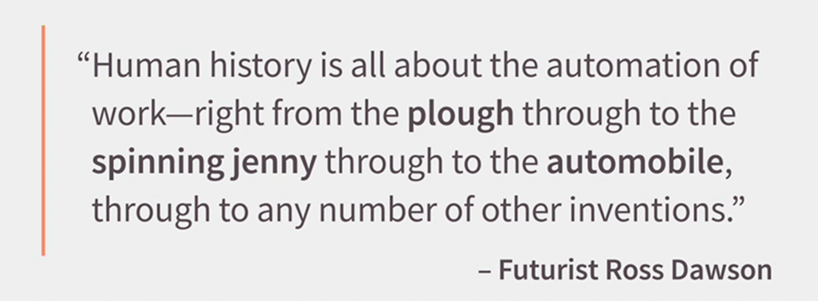

### Introduction
You've probably been following the rules of work that were established generations ago, but you've also probably had the nagging feeling that in a rapidly changing world, a lot of those rules no longer apply.     
What nobody has told you is that there was a completely new set of rules for how you work, how you learn, and how you live your life.   
And you have the opportunity to take advantage of those new rules, so you can not only be effective in your work, but you can love what you do.   

### What's causing the change?
  
The pace of change in the world of work is accelerating.   
It seems that every week brings new word of a particular job that's about to go the way of the Dodo. Some of us may want to go back to what we remember as a simpler time. When many people had jobs for their entire careers, others of us are energized by the possibilities of such a dynamic world of work.   
We can put the responsibility squarely on the shoulders of technology and globalization. These twin juggernauts have changed how we work, where we work and when we work. And increasingly, they're changing the rules of work.   
Now it's not that technology hasn't had a profound impact on work in the past.   
As futurist Ross Dawson has said, human history is all about the automation of work, right from the plough through to the spinning jenny, through to the automobile, through to any number of other inventions. Now, technology has taken away the jobs of lamplighters, switchboard operators and street sweepers.   
But in the past, over time, economies have been resilient enough and innovation has been widespread enough that those who lost work in a disrupted field were often able to find work again.  
**So the big question today is, is it different this time?** How are automation and globalization changing the very nature of work?   
  
In the past, the pace of change has usually been stretched out over years or decades.   
But information technology is unlike any other kind of technology that has come before it. With the advent of robots and machine learning, often called artificial intelligence or AI, technology has the ability to create more technology in ways that were previously the realm of science fiction.   
As we become an increasingly digital economy, we are undergoing a shift in the world of work that's as fundamental as the transition from an agricultural to an industrial economy.   
And it's happening at a blinding pace. This kind of big shift creates a lot of challenges in the work arena, but it also creates a range of opportunities if we can just understand what the new rules are.  