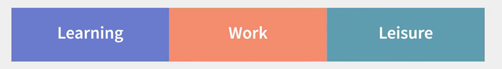
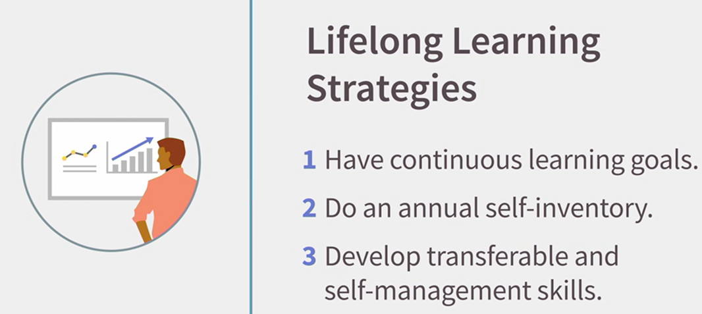
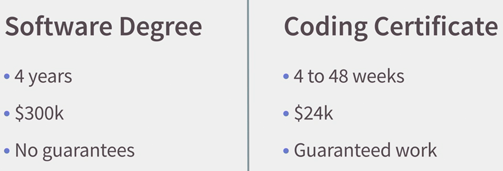
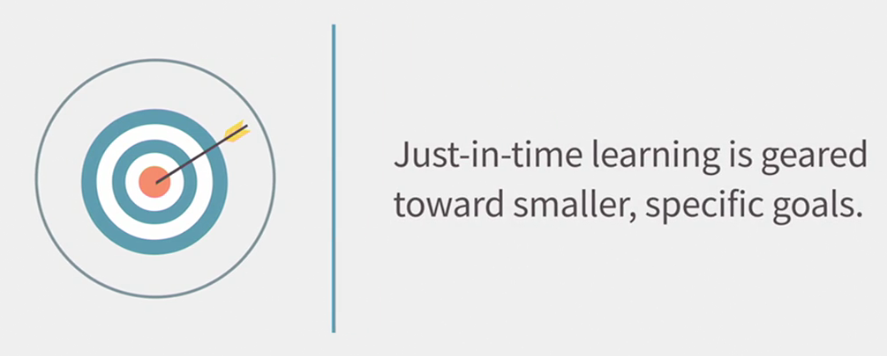

### Rule 1 : Become a Lifelong Learner
The new rules of work require us to have the new rules of learning.  
Our industrial era model of education that's designed to manufacture learners on a mass scale is no longer up to the task of preparing young people for adult life in a time of rapid change.   
Instead, we need a completely new model of learning that lasts throughout our entire lives and helps us to continually adapt to a rapidly changing world.   
  
In his book, "The Three Boxes of Life and How To Get Out of Them", Dick Bolles said that we have three major components of our lives, a big chunk of learning at the beginning, then a big chunk of work, and finally a big chunk of leisure and what I call the period formerly known as retirement.  
  
  
He advocated the need to completely change that model of education from a single box at the beginning of our lives to a model of continuous self-education.   
So that's rule number one of the new rules of learning. You must become a lifelong learner.   
  
  
  
As adults, we accept the work world that will constantly change. So our knowledge of the world has to continually change as well.   
We must think of ourselves as lifelong learners and we have to become adept at navigating our individual paths to work opportunities.   
That's probably an uncomfortable reality for many, especially for those who grew up working in long-term jobs or fields.   
But if you're going to thrive in disruptive times, you need to think and act completely differently.   
So let's take a look at a few **strategies**.   
  
  
  
First, you need to continually have learning goals.   
Each of us has to continually develop a set of topics that fascinates us.   
The shelf life of knowledge is becoming shorter and shorter, so we need to set those goals for ourselves on the kinds of knowledges that we want to grow and the kinds of experiences we want to develop.   
  
Second, it's really critical to do an annual self-inventory because we're constantly growing and gaining new experiences, we have to understand what makes each of us unique, what makes us tick on an ongoing basis.   
We have annual health checkups with a doctor, we also need annual life design checkups, when we assess how our work matches up with our capabilities and goals.   
This also guides the choices we make about our future work and what we'll need to learn and want to learn to help us get there.   
  
Finally, you need to develop transferrable and self-management skills, in addition to your knowledges.   
So much of formalized learning is about developing those knowledges, but we also have to look for learning opportunities that emphasize developing the skills that are transferable and that we use to manage ourselves.   
In the digital era, where so much information is available online those transferable skills are what will allow us to continually adapt.   
  
Well, lifelong learning probably sounds a little exhausting, doesn't it? Does it stop at some point?   
Sure, depending on the kind of work you choose, you could find a field or work that changes more slowly than others.   
But it needs to be emphasized that **_lifelong learning isn't a chore, it's an opportunity_**.   
There are so many exciting opportunities to learn in so many different arenas.   
It shouldn't be an issue of trying to find something that excites you.   
The challenge really should be trying to choose between all the different things that you wish that you can learn.  
  

### Rule 2 : Become a just-in-time Learner
Back when life and work were a little more predictable, you could immerse yourself in learning a field for a long time.   
But you're going to find you have to increasingly look for ways to learn what's needed just before you have to perform the work.   
So that's new learning rule number two, you must become a just-in-time learner.   
  
  
Now let's take the example of computer programming, which is considered one of the hot jobs of today.   
A 4-year software engineering degree at a well-known school could cost upwards of $300,000, yet it comes with no guarantee of future work opportunities.   
It turns out that increasing number of online and in-person code camps charge fees ranging from free to $24,000 for programs ranging from four to 48 weeks.   
And if they're successfully completed, they come with a guarantee to be hired, or you get your money back, which would you choose?   
  
Of course, not all students will be directed enough to choose such just-in-time learning opportunities.   
And a traditional view would be to point out that a code camp graduate might lose a number of things such as the chance to grow up on a campus, build lifelong friendships, or gain exposure to a range of classes that could help spawn critical thinking.   
Every single one of those is a tremendous benefit for those that could afford it, but the number of persons that can either pay such fees or take on that kind of debt is rapidly shrinking.   
  
  
In fact, just-in-time learning isn't just for those who are of college age. You could choose to take one of those targeted learning programs at virtually any age, any point in your life.   
Udacity, calls these nano degrees. And such targeted learning experiences are just one solution to a rapidly changing world of work.   
By allowing workers to become quickly trained in new fields of compensated work, targeted learning offers one answer to the needs of workers who might otherwise be unemployed.   
  
A lot of just-in-time learning comes in increments in smaller learning experiences. If you need to learn a specific task such as doing pivot tables in a spreadsheet, or solving a thorny strategic problem, then a more targeted learning opportunity like a single online course is a great idea.   
  
Of course, for many people, a two, four, or eight year college degree is absolutely the right decision, no matter what age.   
The 2 most important questions to ask yourself are is the kind of environment where you learn best, and can you afford it, both in terms of the time it takes, and the expense of a traditional degree?   

### Rule 3 : Have a portfolio of learning
We've talked about the range of engagement in our work, from mild interest, all the way through to finding work that we feel is part of our purpose for being here on the planet.   
We've also talked about having a portfolio of work, a range of work-related activities that together allow us to maintain our desired lifestyle.   
In the same way that each of us will increasingly have a portfolio of work, we're also likely to have a portfolio of learning, and that's rule number three of the new rules of learning.   
  
Think of the range of topics that you're attracted to.   
Let's say you're mildly interested in website design, or organizational development.   
You might read an article or two on the subject every now and then.   
On the other end of the spectrum, let's say you have a consuming passion for archeology or movie production.   
You look for every opportunity to learn more about those topics, grilling people you meet at parties and obsessively researching everything you can find.   
As the world of work continues to change rapidly, having a portfolio of learning becomes a critical asset.   
Think of yourself as continually looking for those topics that spark your curiosity.   
- How does something work?   
- What kind of jobs do people do in that field?   
- What does it take to find work in that arena?   

Now, as part of this portfolio of learning, it's important to have at least one or two ideas for subjects that could lead to future work activities for you.   
There may be a particular field that fascinates you so much, you might want to immerse yourself in learning more about it.   
  
Now, for some people, this may sound like a big obligation, after all, you already learned a trade or got a degree years ago. Why should you have to go learn a completely different field? Especially if you enjoy what you're doing now? The answer is, everything changes.   
**Work situations change, you change**.   
If you're going to be able to adapt to all those changes, you need to treat learning as a never ending journey.   
  
So, as a lifelong learner, here's some ways you can be investing your time the best.   
- To start, read obsessively about topics that interest you.   
- You can also take online courses, and you can take in-person courses.   
- Find the time to do informational interviews with people in fields that interest you.   
- You can also participate in training experiences with one or more of the organizations you work with.   
- Consider engaging in one or more hobbies, which one day may become paid work for you.   
- And be sure to participate in leisure activities, like travel or sports.   

Together, these will define your portfolio of learning, which will go hand-in-hand with your portfolio of work