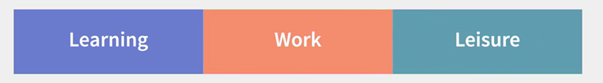

### Rule 1: Plan for leisure like you plan for work and learning
As technology allows us to work and learn from anywhere, work can come to consume your life, if you let it.   
The same goes for learning, especially formal learning like in-person courses. And if you're working and you're in school, well, good luck trying to have any leisure time.   
  
Now, we don't use the common catch phrase work-life balance because that means something different to everyone. But there's no question that work is increasingly a major source of stress in many people's lives.   
And that creates a raft of challenges that only become more difficult as the pace of change accelerates around us.   
We can't let work overtake our entire lives.   
We need to make sure that we dial back the amount of time that we put into our work and intentionally plan for time to learn and to enjoy ourselves.   
So that's rule number one of the new rules of life - Plan for your leisure time just like you plan for your work and your learning.   
  
Let's talk about some strategies for making sure you proactively ensure that you can manage life as a priority.   
  
First, in the same way that you block out time on your calendar for work appointments, block out time for appointments with your friends, your family and yourself. That's a good way to keep from filling every waking moment with work. If you maintain those open times on your calendar, you're much more likely to do more activities that aren't just work related.   
  
Second, try to batch work time together, learning time together and leisure time together.   
One of the reasons we can feel so stressed in our lives is that we often don't honor our relaxation time by taking it in those blocks.   
If we only catch small pieces of leisure time every now and then, we can feel that our stress level isn't easily reduced.   
Take it many vacation days whenever possible, so you can have that block of free time.   
  
Third, if you have any flexibility in the work you do, you're working freelance or part-time, or you have a manager who lets you work from home at times.   
Find the hours that you're most productive for work and block out the other times when you're less productive for your leisure activities.   
For example, I work from home and I'm a night owl, so I code at night. And I try to do things like meeting with fascinating people or going for exercise during the day.   
  
One strategy that some people like is to look for opportunities where the lines start to blur between work and learning and life. For example, when you go to a conference, you are working, you are always learning something new and you are always meeting new people and enjoying myself.   
**So, which is it? Work, learning, leisure or all three.**
  
  
  
But many people prefer to have their lives segmented. So to these people work shouldn't overlap with their personal lives. That's great too.   
Just make sure you're reserving enough time for the activities that aren't defined by work  

### Rule 2: Retirement is time for renewal

  
The three boxes of life, a phrase coined by Dick Bolles, are learning, work and leisure.   
Now the third box, the traditional box of leisure after we're done with our schooling and with our careers, is what I call the period formerly known as Retirement.   
  
People are living longer. The average life expectancy in the India is over 68 years, and that's the average, so many of us are just going to live in longer.   
We're also on average a lot healthier at an advanced age, so many of us are going to be working longer as well.   
In some cases, it will be because we feel energized and motivated by the work we're doing and we see no reason to stop.   
In other cases, many haven't saved anywhere near enough for retirement so they're going to continue to work out of necessity.   
That's why I say rule number two of the new rules of life is, retirement should be renewal.   
  
Treat that period formerly known as retirement as a chance to do a range of activities that renew your outlook on work, on learning and on life.   
Whatever your rationale, it's important to think of that later stage as an opportunity just as you have a portfolio of work and a portfolio of learning, you could have a portfolio of activities later in your life.   
At that stage, you'll have a tremendous amount of experience to pass onto others.   
Well, that's a great opportunity to look for different ways to keep yourself active and engaged with work, whether it's a full or part-time job, sitting on the board of a for-profit or a non-profit company, consulting, mentoring younger workers, doing volunteer work or all the above.   
  
Now for some people, a traditional retirement is the goal. One can understand if you put off doing some of the things that really interests you like traveling to places around the world, or if you've been working in a job that doesn't energize you for most of your career.   
But for many of us, it's not clear why we would actually want to stop working in our later years, there are too many exciting things to do for work and to learn.   
**That's why for many people, retirement time must be renewal time**.   
  
So what's the most effective strategy that you can use to proactively approach your later years?   
Treat it like any career transition, and first do your self-inventory. Look at your own unique skills and knowledges, you should have plenty of them by the time you reach traditional retirement age.   
Make sure to list the range of activities that you'd find interesting and include all those leisure activities like travel that you want to include.   
  
Now for many of us, what will be the most important is the combination of our fiscal health and our physical health.   
**Fiscal health** is the knowledge about your financial resources and whether that can support or limit your possible activities.   
More money saved for retirement, more options. Less money saved, well, you probably need to get more creative with your planning.   
For example, if you want to travel but you aren't sure you have the money you need, consider doing work that pays for travel activities, such as writing travel articles, or maybe being a travel guide.   
  
In the same way your activities might be supported or limited by your **physical health**.   
You may have to consider certain kinds of work that are tailored to your physical condition at the time.   
  
Again, doing a complete self inventory of your skills, your interests and your capabilities is key.   
And when you look at issues like compensation, that's where a complete fiscal plan will help you to understand what kind of income you need and when you'll need it.   
And when you look at working conditions, that's where you can think about the kinds of support you might need for any physical limitations that you need to adjust for, but be sure to plan for the long haul.   
As said earlier, many of us are going to be living and working a lot longer.  
  
### Rule 3: Make time to give back
  
One of the most important of all the new rules has to do with why? Why are you working? Why are you learning? Why do you engage in leisure time?   
  
The first answer we hear is, invariably, to meet your own needs. You'll have tremendous satisfaction if you're doing the kinds of activities that you most enjoy.   
Of course, you need to eat, you need a roof over your head, and you need to be healthy, all of which are more possible if you're doing fulfilling work.   
  
The second reason why is for your friends and family. They also need to eat, they need a roof over their heads, and they need to be healthy, and you can support their lives through your work.   
  
The third reason is to help others, people who aren't part of your family or friends, but people who need help, people you may not even know.   
And that's the focus of the third new rule of life, give back.   
  
  
  
It is not suggested that you should be looking for ways to help all of humanity. Nor that you quit your job and just go volunteer someplace for no pay, although I wouldn't stop you from doing either of those things.   
What is being suggested is that as you figure out how to continually adapt to the new rules of work, of learning, and of life, there will be others who aren't quite as adept at it as you are.   
So here's your opportunity.     
As you navigate this brave, new, constantly changing world, you have the chance to help other people.   
Suppose, for example, you've learned how to become an adaptive problem solver.   
You manage a portfolio of work where you always have an interesting set of projects that together pay what you need to do to have your ideal lifestyle.   
In a constantly changing world that's a huge accomplishment.   
You could be helping others to learn how to proactively solve problems too.   
  
Or suppose you become a lifelong learner, naturally on you own.   
You're curious about many a different things.  
You're always taking courses and researching topics that fascinate you and you're continually discovering new opportunities for work.   
That's something you can teach others as well.   
Remember, there are still many people who were following the old rules and who aren't achieving life as they'd hoped to, as the landscape of work has changed dramatically.   
You can help others to become agile navigators of the new rules as well.  
