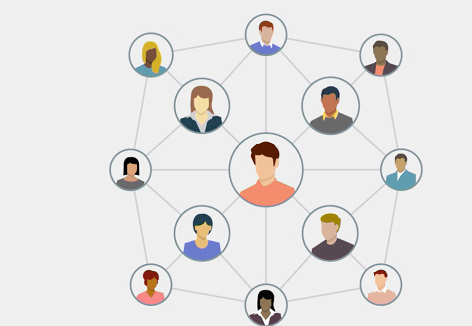

### Rule 1: Do the work you love
  
It used to be okay to settle for work that didn't excite you, but if you're going to increasingly compete with others for work, then you're going to need to do work that motivates you.   
So, rule number one of the new rules of work is, do the work that you love.   
One of the most fundamental understandings of ourselves is that we each have a completely unique mix of skills, knowledges, traits, experiences and interests. Nobody else on the planet has exactly the same characteristics as you. And that unique mix means that there's a range of different kinds of work that you could be doing.   
  
Dick Bolles, author of "What Color Is Your Parachute?", the enduring career manual, has found that the key to being motivated at work is in finding or in creating a match between your unique characteristics and the work that you do.   
Over and over again, we've seen that the better that match is, between what's true about you and your work, the better your satisfaction and motivation.   
  
So why is motivation more important in a world of constant change? There are several important reasons.   
  
First, workers will increasingly stand out because they're motivated. Think of motivation as a spectrum. On one end, we're completely disinterested in the work that we do. We show up, we do it, but we have zero motivation. But on the other end, we jump out of bed in the morning. We're energized by the opportunity to do the work that we love. Now in a more static world with nine-to-five jobs and repetitive work, it was possible to do work that didn't motivate you very much. But you're going to increasingly find that being highly motivated by the work that you do will not only make you stand out, it will give you the drive to continually excel at what you do.   
It's absolutely your choice if you don't want to be motivated at work, but you're going to find it will increasingly put you at a disadvantage.   
  

  
Second, workers who are doing the work that they love are far more likely to be more creative, more innovative, and more proactive in doing their work.   
That increases your ability to perform your work and to repeatedly find new ways to solve problems.   
Now, using your fingers as circles, if your left hand circle is all of the skills, knowledges and work environment characteristics that make you happy in your work and your right-hand circle is your current job, how much of an overlap do those two circles have? And how much do you want them to have? The greater the overlap, the more agile you'll be in continually doing the work you're motivated to do. And that will be one of your greatest assets in a constantly changing world of work.  

  

### Rule 2: Be an adaptive problem solver
  
Our constantly changing world isn't going to slow down anytime soon. So, need to be an adaptive problem solver.   

Let's start by looking at the fundamentals of work.   
Why do we get paid for the work that we do? It's to solve problems and to generate results.   
How do we solve problems? We perform tasks, and how do we perform those tasks? We use our skills.   
So here's the sequence, we use our skills to perform tasks and solve problems to generate results.   
For example, a fast food company has problems like getting food into the hands of happy customers and getting paid for it.   
Tasks such as taking orders and making change are performed using skills like listening, handling money, making change and so on.   
And the result should be that food gets delivered into the hands of a happy customer. And money gets deposited into a cash register.   
  
Or a consulting company has problems, like helping clients develop complex market strategies, tasks such as conducting research programs and engaging in strategy design are performed using skills like analyzing, interviewing, synthesizing and writing. And the result is a happy client who has a new strategy.   
  
In a rapidly changing world, successful workers will increasingly be the ones who seek out problems to be solved and who come up with creative ways to solve them and to generate results.   
But the problems we're asked to solve tomorrow probably won't be the problems we're solving today. That's why we need to be adaptive. The work world will constantly change. So we'll need to learn how to continually adapt.   
Even once we picked up a kind of work we very much want to perform. We have to be prepared to do a completely different kind of work in the future.   
  
Now, what does it mean to be adaptive? Here are three characteristics.   
Adaptive workers are continually aware and they're always on the lookout for changes in their work environment. They ask questions and they're constantly trying to understand the changing dynamics of their work.   
  
Adaptive workers are continually innovating. They don't fall in love with any particular way of doing something. Instead, they're constantly looking for new ways to solve problems.   
  
Adaptive workers are continually learning. They don't assume they know everything about their work. In a constantly changing work environment, they know there will always be something new to learn.   
  
Let's face it, if you thrive on stability, you'll need to look even harder in the future for work situations that don't change on a regular basis.   
Now, the good news is that in a world of constant change, we can increasingly use technology to help us solve those problems.   
Technology can amplify our skills, allowing us to do things we couldn't necessarily do on our own.   
So technology itself can help us to be far more adaptive.   

### Rule 3: Think like an entrepreneur
Now being passive may have been okay in the time of the old rules of work. If you weren't especially engaged in your work, and you didn't care all that much about the problems you were solving, maybe it was acceptable that you didn't have to be very proactive, but those days are increasingly behind us.    
Instead, whether we work in a large company or we're a start-up of one, or something in between, we need to think like entrepreneurs, which is the third new rule of work.    
   
**So what do entrepreneurs do?**    
They identify problems proactively, they don't wait for problems to come to them.    
This is about dynamically binding around problems, bringing your unique skills to bear on identifying and solving challenges and roadblocks, then pulling others into the process of generating results.    
   
Entrepreneurs make decisions based on the information that they have at hand, they don't wait until they have the perfect information they'd like to have.    
Entrepreneurs also gather as much information as they can, in a brief period of time, then they act and they do their best not to second guess their decisions after the fact.    
   
But, perhaps, the most important trait of entrepreneurs is that they take smart risks.    
They put themselves in a position where they could fail, and when they do fail they don't treat it as a life-changing problem, they treat it as a badge of courage, and then they go on to the next challenge, incorporating what they've learned, so they don't fail at the same thing again.    
As investor and entrepreneur Esther Dyson says, "_Make new mistakes_."    
   
In large companies though, making new mistakes is one of the hardest things to do. Unless the organization supports a culture of risk-taking, a single mistake could brand you as a failure.    
That's why these people are called Intrapreneurs.    
People who act entrepreneurially in large organizations deserve a tremendous amount of credit for putting themselves in situations where they're taking visible risks.    
   
John Hagel, at the Lloyd Center for the Edge, says that it's hardest to do this kind of entrepreneurial activity in the center of the organization, that is in a division or a department that's in the middle of the company's core business.    
It's far easier to act entrepreneurially in a new venture or in a small department that's not at the center of the organization, but no matter where you work in your organization you'll need to look for ways that you can be more proactive.    
And we call this kind of proactivity - Agency, taking initiative, attacking new problems, coming up with new solutions.    
This is how workers are agent-ful, delivering new value to the organization and gaining more satisfaction in their work.    
   
Finally, thinking like an entrepreneur doesn't necessarily mean you should go out and start a company, though it doesn't mean you shouldn't either.    
What it does mean is that you need to be more of a risk-taker, and you're going to find the results will be tremendously rewarding.   

### Rule 4: Work with others to solve a pool of problems
  
The old rules of work meant you didn't always have to collaborate with other people. Even if you were part of a team, you might've worked somewhat independently of others workers.   
But in a constantly changing work environment, you and your fellow team members will increasingly need to work together to solve problems.   
You're going to find you need to collaborate across departments and divisions across organizational boundaries and with people all over around the world.   
So, rule number four of the new rules of work, work with others to solve a pool of problems.   
  
In order to be an adaptive problem solver, what you'll increasingly find is that you and your coworkers will need to work together as a team of problem solvers.   
So, rather than being a set of individual workers who operate in parallel, think instead of the pool of problems that your team is charged with solving.   
What if you approach that set of problems as a team dynamically allocating the tasks to be solved between yourselves so that each person's unique skills could be brought to bear on the most appropriate problems, that's what it means to be a pool of problem solvers.   
  
Now, how can you know the kinds of people with whom you'd work best? Well, there are numerous approaches. Psychologists call this the **Person Environment fit**.   
That essentially means that you have a set of unique characteristics and so does where you work and especially the kinds of people with whom you work.   
Since few things in life are ever perfect person-environment fit is really about optimization, which is trying to continually adjust to increase the match between you and your environment.   
  
One theory of person-environment fit is known as your Holland Code. That code can give you some pretty good insights about the kind of people-environment that you'd like to most work at.   
  
Now there's another approach that's called the Myers Briggs Type Indicator, which is a schema based on psychologist Carl Young's archetypes. And that gives you a four letter code that helps you to understand the kinds of ways you solve problems and how you interact with other people. Once you know that Myers Briggs Code, you can get a good idea of the kinds of people with whom you work best, and the kinds of people you probably have some more difficulty communicating and collaborating with.   
  
You can think of this process as finding your tribe, the kinds of people with whom you feel the most affinity at work.   
Working with your tribe can bring a tremendous amount of satisfaction because you feel you're working with the people who think and act like you and reinforcing your own skills and knowledge.   
But don't, over-index on your tribe. Don't create a situation where all you see are the kinds of people who think like you.   
Researchers show that the best ideas come from heterogeneous groups with lots of ideas from people who think far more differently.   
It's great to work with people you think of as your tribe, but if you're going to be a member of a team of problem solvers make sure you have plenty of chances to collaborate with people who are dramatically different from your tribe as well.  

### Rule 5: Have a portfolio of work
In a world of rapid change, we need a new model that helps each of us to continually grow and develop and to continually find new sources of opportunities for compensated work, what we used to call a job.   
Without our necessarily realizing it, our actual relationship with work is changing.   
  
When our relationship to work is binary, we either have a job or we don't, we usually have predictable activities and earnings.   
But when rapidly changing times means we have a fuzzier relationship with work, perhaps requiring multiple sources of income from a variety of activities.   
I call this a portfolio of work.   
  
In the same way that an investor often has a distributed portfolio, some safe investments, some riskier investments, an important strategy for dealing with the uncertainty in the world of work is to have more than one activity at any one time. And the most entrepreneurial of workers will have a range of activities they do to generate income, and to perform the kinds of activities that they really enjoy.   
  
So what are all the different ways that you can work? You could be full-time long-term or full-time temporary.   
Or you could work part-time long-term or part-time temporary.   
You could also be on call or doing project-based or piecework.   
  
Maybe you could be doing app-based work, such as driving for Lyft or doing tasks for TaskRabbit.   
  
You might be doing what's known as asset-based work, such as sharing something you own on Airbnb, selling and buying assets on something like eBay, or creating and selling wares on something like Etsy.   
  
Perhaps you might be participating in an online work co-op.   
You could also be starting your own company on the side.   
Or you might be doing several of these all at the same time.   
  
Now, of course, jobs as we know them will continue to exist for a long time. But for many people, there will be strong incentives to work in a different manner.   
Alternatives to traditional jobs have existed for years. But the incentives to use those alternatives are increasing.   
Think of each of these alternatives as parts of your portfolio of work.   
  
A portfolio of work is inevitable for each of us and it's already in practice by many workers.   
For those who thrive on variety and change, a portfolio of work is ideal. Life is varied. There's a constant flow of new challenges.   
  
But for those who thrive on stability and predictability, a portfolio can mean stress and uncertainty.   
Even if you only have one job, you probably already have at least one additional work-related activity in your portfolio.   
You might have a hobby that could turn into work. You might have an idea for a startup that you're working on.   
Or you might help out with projects with friends or at a nonprofit, which could turn into compensated work some day.   
If for no other reason, think of a work portfolio as a kind of insurance. In a constantly changing world, there's no guarantee that your current work situation is going to remain static.   
  
Now, to some people, this is a really exciting opportunity, which means constant variety and change, while to others, it sounds like a lot of work.   
If you already are good at things like time management and communicating with people in your network, you'll find that you're naturally drawn to this kind of work context.   
But you may find you'll need to hone these kinds of skills if you haven't practiced them much until now.   
Just as entrepreneurs are always trying to anticipate problems before they arrive, it's going to be increasingly useful to expand your portfolio of work and to continually look for new ways to do the kinds of work that you love.  

### Rule 6: Build and tend your network
  
  
In a more aesthetic world, you probably didn't need much of a network of contacts. If you only change jobs every decade or so, you didn't need to go through many other people to find that work, but that's an old rule.   
The new rules of work mean you'll increasingly need a network of connections to do your work and to find new work.   
  
One of the most influential research papers on networks comes from a sociologist by the name of Mark Granovetter, who wrote a paper called The Strength of Weak Ties. His thesis was that some of the greatest value from our connections with other people is at the edge of our networks, not at the core.   
The people we know well, those who are at the center of our network are likely to hear about the same opportunities that we are and the more likely are potential competitors than they are our allies, at least when we're looking for work.   
Today, we maintain a lot of weak ties through online social media, like Facebook and LinkedIn, but having weak ties doesn't mean that you should build your network without being intentional about the connections that you make.   
You could have a broad network, but make sure that even the weaker connections are quality connections.   
  
As the walls of organizations become more pliable, people are more frequently moving in and out of work situations.   
That means that you'll frequently be meeting a variety of people, sometimes briefly, sometimes in deeper contact.   
  
It's essential that you build that network over time, maintaining connections with those with whom you share interests and experiences.   
  
It also means you should take care when adding to your network.   
If you don't really know someone, if you've never met them and you don't really know anyone who knows them, it's still possible you want them in your network.   
But it's important to be as intentional as possible.   
  
When you make a decision to add someone. Remember too, that while you'll probably make many of your connections online, the best relationships are actually cemented in person.   
So it's important to seek out opportunities to see people in your network face to face, that will increase the quality of the connection between you.   
It'll also make it more likely that you'll understand what's important to others in your network, so you can make it a two way street.   
Just as you may someday need the help of people in your network, you'll want to know how you can be helpful to them.   
  
It may help you to think of your network as a garden. You need to grow it, nurture it, and do your best to keep it healthy and thriving.   
Beyond your own skills and abilities in a world of constant change, your network is the greatest asset you'll have.  
  

### Rule 7: Do work driven by meaning
Any of us, no matter what age, has the opportunity to look for that meaning and to seek out what we believe to be our purpose.   
Of course, if you don't feel it's important to have your work be a source of purpose in your life, it's completely your choice.   
But it's my fervent hope for you, though, that you find meaning and purpose in some other part of your life outside your work.   
  
It's never been more possible for a single passionate individual or group of passionate individuals to have a positive impact on the world.   
Look, there's too many important things to do, and there aren't enough people and time to do them.   
That's why we all need to look for that meaning and purpose in our work, and you can do it too.  

Credits : [Gary Bolles](https://www.linkedin.com/in/gbolles/?trk=lil_instructor) - [Program](https://www.linkedin.com/learning-login/share?account=2272706&forceAccount=false&redirect=https%3A%2F%2Fwww.linkedin.com%2Flearning%2Fthe-new-rules-of-work%3Ftrk%3Dshare_ent_url%26shareId%3Dt3tRwyBYTZ6df1PO5fdpMA%253D%253D)