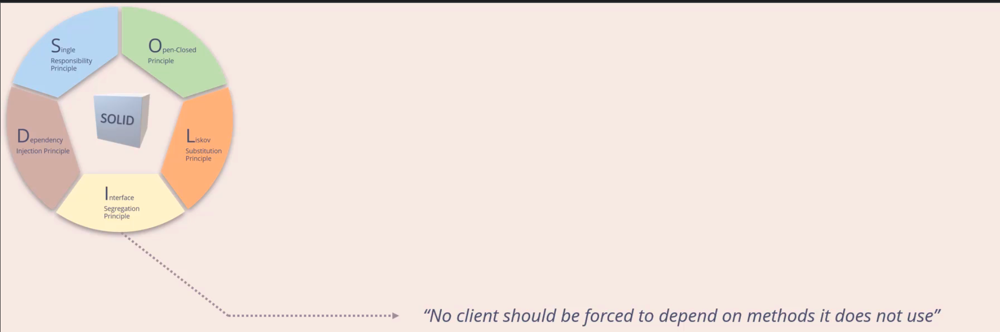
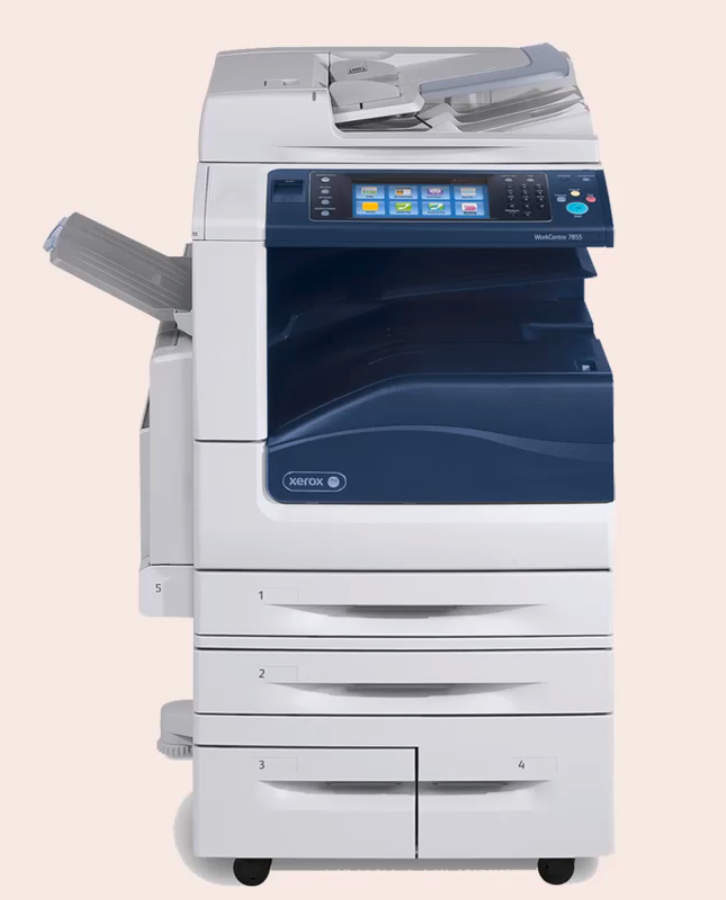
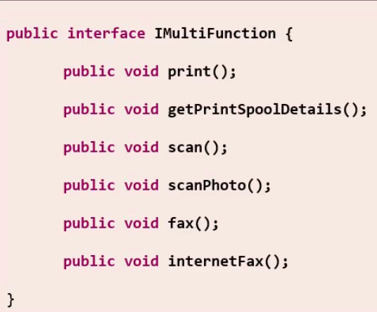
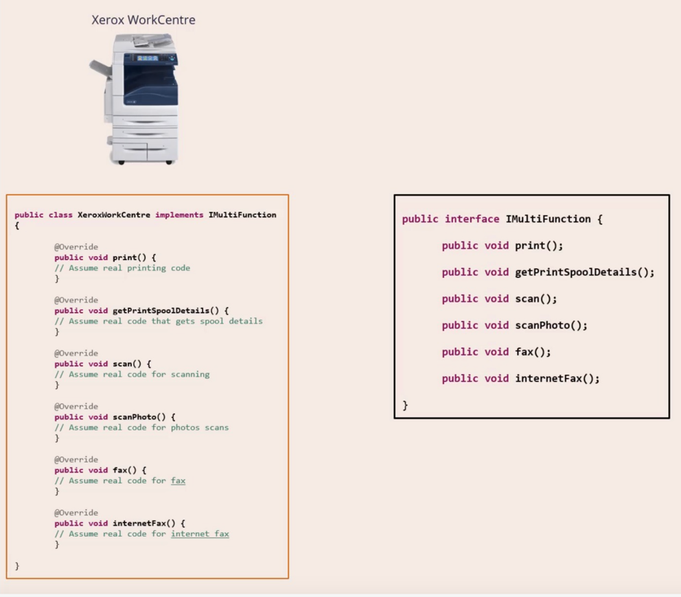
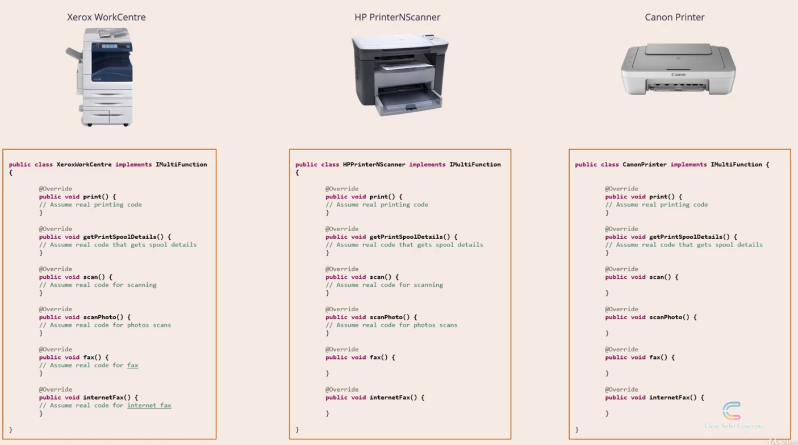
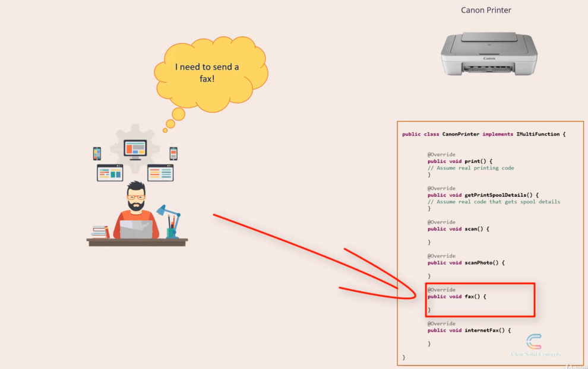

### Introduction
  
  
'I' stands for Interface Segregation Principle. This is often abbreviated as ISP.  
This principle says - "No client should be forced to depend on methods it does not use".  
  
To explain this, as always, lets start with a real world analogy.  
Assume you are working in an office which has around 200 employees.  
You have a bunch of printers , scanners and fax machines available for the employees to use.  
As a software developer, you have been asked to represent these devices using object oriented concepts in code.  
You have to design some interfaces too, to ensure a certain level of uniformity among these devices.  
  
You start walking around the office floor, and you spot THIS device.This is a multi-function all-in-one Xerox WorkCentre, that has a printer, scanner, copier, and a fax machine all built into one.  
  
  
You think that this could be a good starting point.  
You feel that if you can design a common interface based on this all-in-one device, that will give you a good start.  
So lets see this in code.  
  
First, you design an interface named IMultiFunction.  
This interface defines methods that represent various functions.  
   
  
We have the print() and getPrintSpoolDetails() methods that are associated with printing.  
We have the scan() and scanPhoto() methods that are associated with scanning.  
The fax() and internetFax() methods deal with fax related functions.  
  
Now you create a concrete class that represents this particular device - The Xerox WorkCentre.  
You make it implement the IMultiFunction interface. So you will have to implement all the 6 methods().    

    
All good so far.    

Now you walk over to the next couple of rooms in your office, and encounter 2 different machines.    
First is an HP printer-scanner device.  
Its not as multi-faceted as the Xerox WorkCentre but it can still do a couple of functions - printing and scanning.  
For it, we implement the print(), getPrintSpoolDetails(), scan() and scanPhoto() methods.  
What about the other methods in the interface?  
If you are implementing an interface, you HAVE to implement ALL methods in it.  
So what we will do is we will implement the fax() and internetFax() method and give it a blank implementation.  
  
This machine does not have to ability to send or receive fax, which is why, we have to leave these fax related methods unimplemented.  
  
Second one, is a Canon printer device and has printing functions alone.  
So we will create a class to represent this device and make it implement the IMultiFunction interface again.  
We will implement the print() and getPrintSpoolDetails() methods.  
But then, we will have to implement all the other methods as well and leave the implementations blank.  
So scan(), scanPhoto(), fax(), internetFax() , leave it all blank.  
  
  
  

Now you start seeing the problem.  

Unimplemented methods are almost always indicative of a poor design.  
  
This goes against the Interface Segregation Principle which says:"No client should be forced to depend on methods it does not use".  
  
So what is the problem if we don't fix this? Why is this a bad design?  
  
We leave the methods blank - What's the big deal?  
  
  
  

Assume you have a employee portal application in your office that needs to directly access these devices.  
So you have to provide these device classes packaged as a library, to a group of programmers who are working on this employee portal.  
  
One programmer wants to send a fax, he sees the fax() method on your Canon Device class, and invokes it.  
He does not care to look inside the method, and understand that it is a blank implementation.  
He does not need to, in fact.  
  
All the programmer sees is the fax() method on the Canon class, assumes that this device has the ability to send a fax, and invokes it from the employee portal.  
This is calling for trouble, and the code will definitely break, because this method implementation is blank.  
  
So this is the reason why this is a bad design.  
  
And this is why Interface Segregation Principle recommends to avoid such designs.  