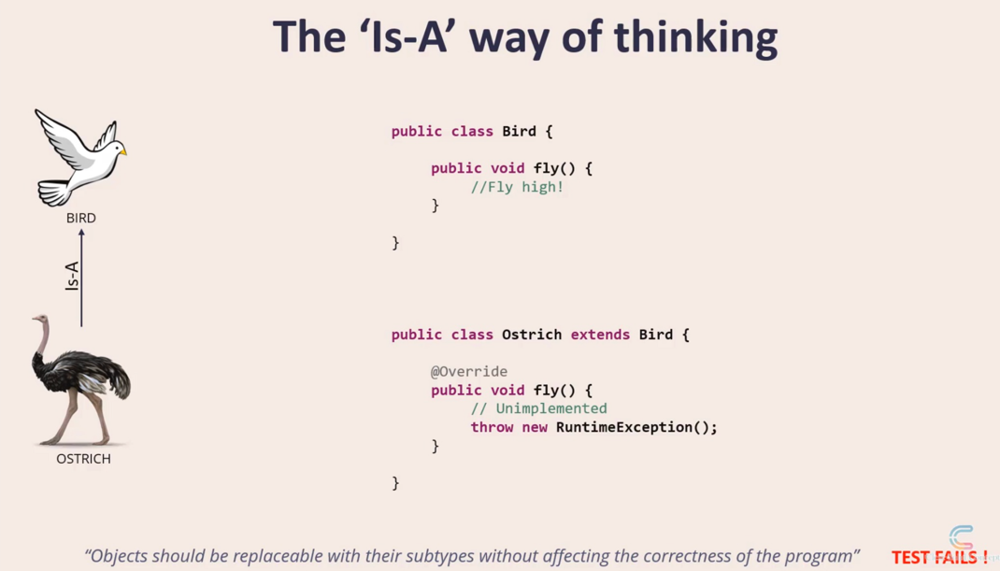

### Introduction

  

'L' stands for Liskov Substitution Principle. This is often abbreviated as LSP.  
It is named after a computer scientist Barbara Liskov who explained this principle in a book that she authored.  

The principle says "Objects should be replaceable with their subtypes without affecting the correctness of the program"  

To explain this, we will start with inheritance, which is a basic feature of any object oriented programming language.  

#### 'Is-A' relationship
Inheritance is also referred to as the 'Is-A' relationship.  
  

Take the example of a car class.  
A hatchback extends a car class. So we say hatchback 'is-a' car.  

Let's take another one: We have a bird class, and ostrich extends bird. So Ostrich 'is-a' bird.  
Another one: Fuel and gasoline. So gasoline extends fuel, or gasoline 'is-a' fuel.  

On the face of it, all of this sounds perfect and sounds like text-book examples.  

But there are hidden problems with this approach, which may not seem obvious at first.  

Among these 3 examples, the one in the middle has a hidden problem i.e. _Ostrich is-a bird_.  

So Ostrich is a bird. And by all means of real-world classification, an ostrich is a bird alright.  

As per the biological classification too, ostrich is a bird.  
But, here's an interesting fact, an ostrich cannot fly.  

Let's see this in code now.  
  

So we have a Bird class with a fly method.  
Then, we have an Ostrich class that extends the Bird class.  
Because the fly() method does not make sense for an Ostrich, what the Ostrich class does is, it overrides the fly method from the Bird class and leaves it unimplemented.  
**Unimplemented methods are almost always indicative of a design flaw**.  
Now, the statement Ostrich 'is-a' bird might still be correct.  

But if we apply the Liskov Principle here, which says: Objects should be replaceable with their subtypes without affecting the correctness of the program.    
This test fails - because you cannot use an Ostrich object in all the places where you use the Bird object.  
If you do so, and someone calls the fly() method on the Bird object, your program will fail.  

So the Liskov Substitution Principle requires a test standard that is more strict than the 'is-a' test.  

It wants us to move away from the 'is-a' way of thinking.  

  
  

This is a line often associated with the Liskov Substitution Principle: If it looks like a duck and quacks like a duck, but it needs batteries, you probably have the wrong abstraction!  
Instead, the Liskov way of thinking should be: Objects should be replaceable with their subtypes without affecting the correctness of the program.  

### Breaking the Hierarchy
Here we are going to examine the Liskov Substitution Principle in depth.  
We will take 2 examples and analyze and find out the design flaws in each one of them.  
Then we will apply the Liskov Substitution Principle and improve the design.    

One example is discussed here, and we use the approach 'Breaking the Hierarchy'.  

In a given case, we have a generic Car class.  
We have a racing car, the ones from the Formula One racing.  
Racing car extends car.  

Let's see what the code looks like now.    

    

The Car class has one method getCabinWidth() that returns the cabin width of the car.  

The RacingCar class overrides the getCabinWidth() function and leaves it unimplemented.  

Why? That's because racing cars have a set of specifications some of which might not match that of a generic car.  

In a generic car, we call the width as cabin width.  
But in a racing car, there is no cabin. The interior space is called a cockpit.  
So racing cars do not have a cabin width. But they have a cockpit width.  
So the racing car implements a getCockpitWidth() method accordingly.   

Now, lets create some objects of Cars and RacingCars and play around with it.  

  

In order to do this, we will look at a utils class called CarUtils.  
So CarUtils instantiates 3 objects with reference Type Car.  
Note that even though the reference for all 3 objects is Car,2 of them are generic car instances, the 3rd one is a racing car instance.  

We insert all 3 car reference objects into an ArrayList and name it myCars.  

Next we iterate through the car list and we print out the cabin width of each car.  

The first two objects are Car Objects. So the getCabinwidth method works fine.  
But in the third iteration, the object is a RacingCar object.  
And RacingCar overrides the getCabinWidth() method and leaves it unimplemented.  
So in the third iterations, this code will not work correctly, because of an unimplemented method.  

_So this is the design hole that has been exposed._  

So how do you fix this?  
    
We have to strike at the root, which is the inheritance itself.  
So we have to break the inheritance.  
RacingCar should no longer extend Car.  
Instead, we'll come up with a common parent for both.  
So we create a new class called Vehicle which is a very generic class which can represent any modes of transportation including a truck, a boat, or an airplane.  
Then we make both Car and RacingCar extend this Vehicle class.  

We need to restructure the code also accordingly.  

Let's see how that can be done.  
First is the vehicle class, which has one method, called getInteriorWidth().  
Note that it is neither cabin width nor cockpit width, but a much more generic abstraction called interior width.  
Next we have the Car class that extends Vehicle. The 'Car' class overrides the getInteriorWidth(),which in turn calls its getCabinWidth() method internally.  

Next we have the RacingCar class that also extends Vehicle.  

The 'RacingCar' class also overrides the same getInteriorWidth(), which in turn calls its getCockpitWidth() method internally.  
So that's the code restructuring that is needed to follow the new hierarchy.  

Finally, lets look at the same CarUtils class again.  
We have renamed it to VehicleUtils by the way.  
Again, we have the first two car objects and the third RacingCar object.  

First two iterations, the getInteriorWidth() method gets called on the car objects. The Car objects, in turn,call their getCabinWidth method.  
In the third and last iteration, the getInteriorWidth() method gets called on the RacingCar objects, which in turn, call their getCockpitWidth method.  
So all calls work correctly. And the whole thing is dynamic.  
Because of the way we designed the hierarchy, we can simply iterate through any number of objects of reference type Vehicle and get the interior width,without ever bothering to know if they are Car objects or RacingCar objects.  

So the solution that we applied to this pattern of problems is called '**_Breaking the hierarchy_**'.  

There is one more pattern where we apply the Liskov Substitution Principle in a different way.  

### Tell, Don't Ask
Case Study ->  
We have a generic Product class.  We also have an InHouseProduct class that extends the Generic Product class.  
Just think of it from the perspective of an e-commerce website like Amazon.  
Amazon sells a number of products on its website, mostly from third party sellers. But Amazon has its own set of products too, which they manufacture InHouse (Amazon Basics).  

Assume ,all Products get a base discount of 20%.  
But, if it's an In-House Product, it gets 1.5 times the existing base discount.  
This is the hierarchy that we need to implement.  

Lets start with an initial version.    

    

We have a product class, which has a discount variable, and a getDiscount() method which returns the discount percentage.  
Then we have the InHouseProduct class, which has a applyExtraDiscount method, that simply takes the existing discount and multiplies it by 1.5.  
Note that the InHouseProduct does NOT override the getDiscount() method, so it will simply inherit the getDiscount() method from its parent, the Product class.  
We will now use a bunch of these product and InHouseProduct objects in another class. This class is named PricingUtils.  
  
It instantiates 3 objects, 2 of them generic products, and the third one an InHouse Product.  
Note that all 3 are of type reference Product.  
Next, we iterate through this list of objects which we just created.  
  
For the first two products, the 'if' condition returns false, because they are not InHOuseProducts, and so the instanceof operator returns false.  
So it skips what is inside the 'if' condition.  
And it simply prints the discount for each of the two products. For the third product though, because the product is an instance of InHouseProduct, it gets inside the 'if' condition.  
Then it calls the applyExtraDiscount() method which multiples the existing discount by 1.5.  
Then it exits the 'if' loop and prints the final modified discount.   
 
What we are seeing now in this Utils class, is NOT a good design. This is _against the Liskov Substitution Principle_.  
We should have been able to deal with all the objects as Product objects itself instead of typecasting to InHouseProduct for some of them.  
So how can restructure the code to achieve this?  
  
  
  
First, we will override the getDiscount() method in the InHouseProduct class.  
The overridden getDiscount() method, in turn, will call the applyExtraDiscount() method.  
  
Now, we'll do the corresponding change in PricingUtils.  
No change to the product instantiations.  
  
The only difference is that the instanceof check is now gone.  
  
We do not need to bother if the objects are instances of Generic Product or instances of InHouseProduct.  
By doing this, the Liskov substitution test gets passed now.  
So objects can be substituted by their subtypes without affecting the correctness of the program, in this particular example.  
  
So we have the product reference here, but it contains a InHouseProduct, which is a subtype of Product.  
  
Still the program works as expected, and its correctness is not affected.  
This is a second pattern of problems, where the Liskov Substitution Principle is applied.  
  
The solution to this pattern is called 'Tell, Don't Ask'.   
In the initial version of code,we are ASKING or enquiring about the subtype , from INSIDE the Utils class.  
But, lets go the final version now. Here, we are TELLING the Utils class, the Utils class does not need to ask anything. This is what we mean by 'Tell,Don't Ask'.  
  
So, to sum up, we saw two patterns of problems, the solution to the first one was to break the hierarchy as we saw in the RacingCar example.  
And the solution to the second one is to restructure the code, so as to follow the 'Tell, don't ask' rule.  

