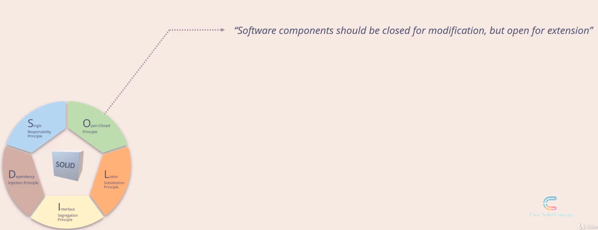
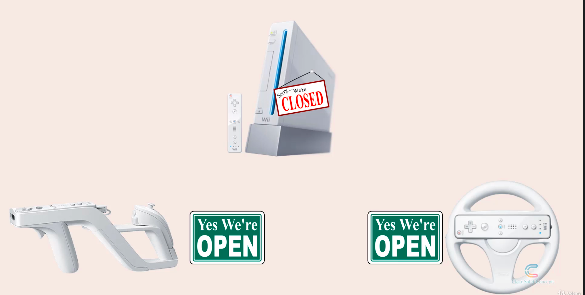
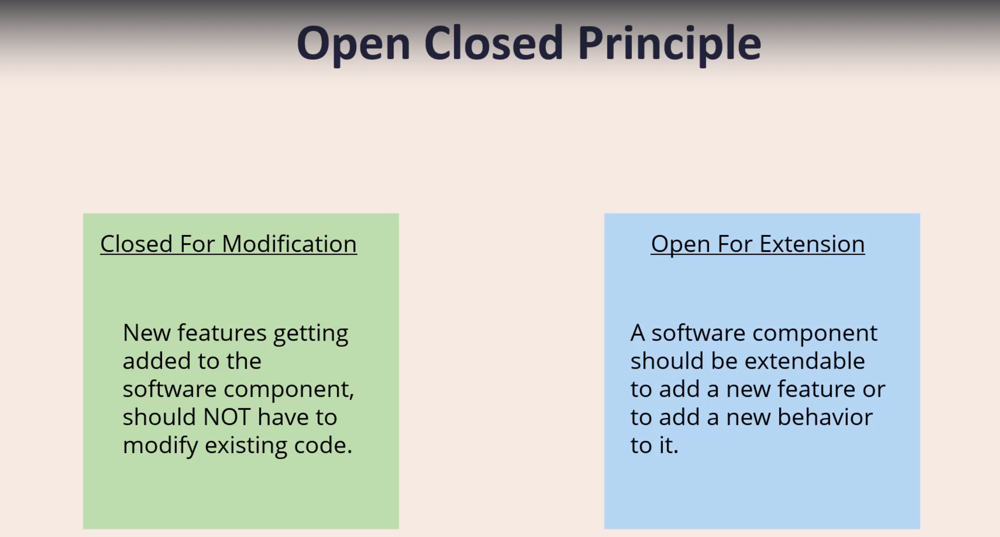
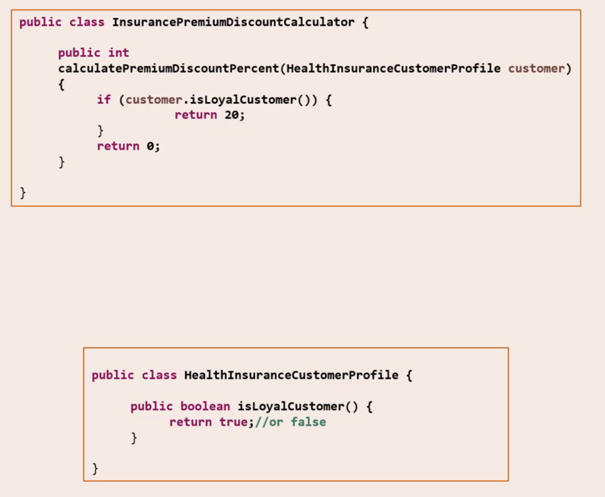
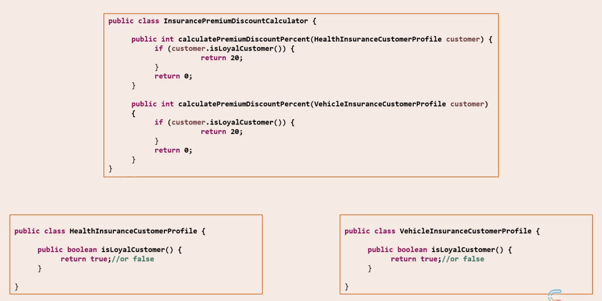
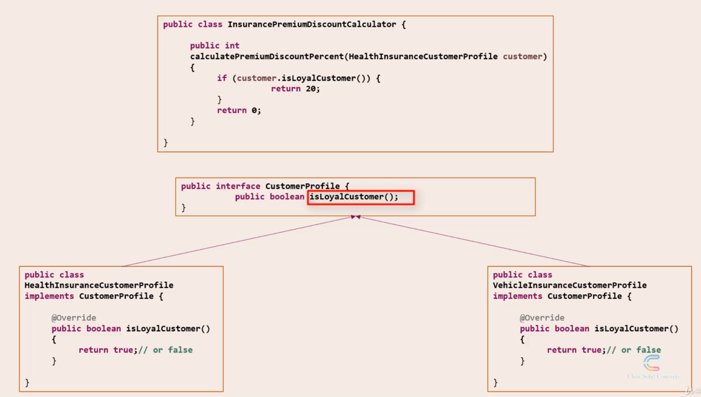
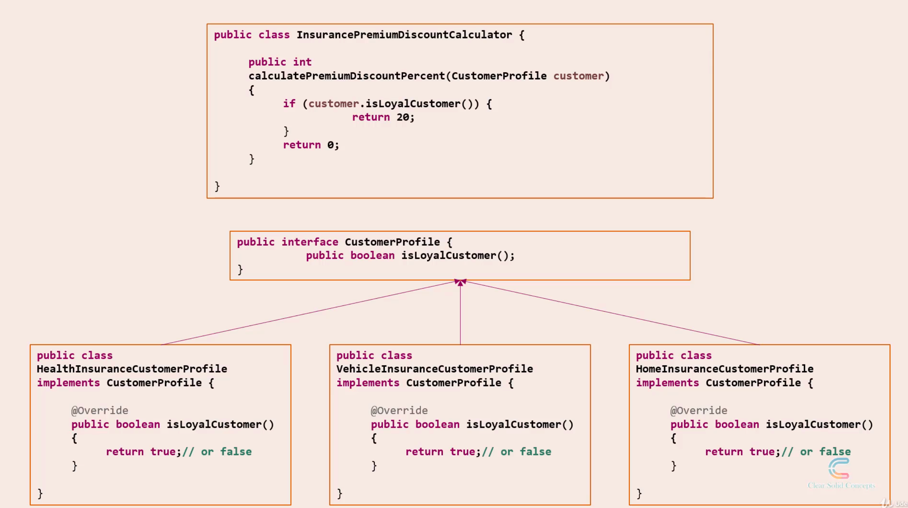
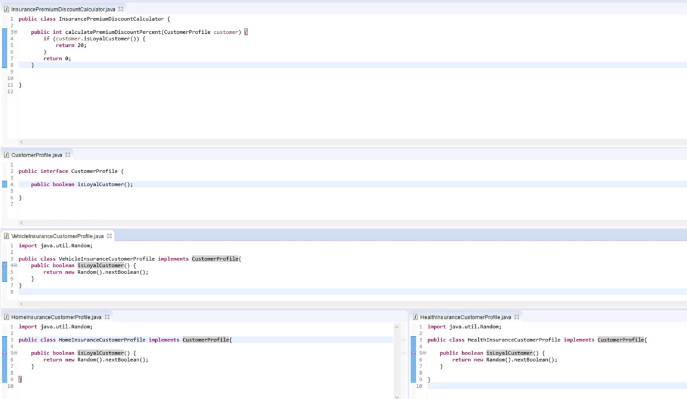

### Introduction

'O' stands for Open Closed Principle . This is often abbreviated as OCP.  

As per OCP, "Software components should be closed for modification, but open for extension"  
So this presents kind of a conundrum: How can something be open and closed at the same time?  
To explain this, we will take the help of a real world analogy.  
Most of you should be familiar with this device - this is the Nintendo Wii, a very popular gaming console, though its discontinued now.  

  

So when you buy the Wii console, what you get is the console itself which is the CPU tower kind of thing, and a basic remote controller. You can see both in the picture now.  

Wii also manufactures a number of accessories that can go with the Wii. For instance, there's Wii Zapper, which is a good accessory for playing FPS or first person shooter games in Wii.Setting this up is pretty simple. You just place the basic remote controller into a cradle inside the zapper and you are all set.  

So the Zapper has now added a really useful feature to the Wii.  

Another accessory is the Wii steering wheel, which is a really good accessory to have, if you are into racing games.  

The steering wheel is also setup in the same way. You just put the remote controller into the cradle and you are all set.  

Now think about this: In order to add the Zapper feature and the steering wheel feature, did we do any visible change to the CPU or the basic controller?  

No. Nothing.It was just plug n play.  

Think about a situation where Wii wanted you to move a jumper on the console's motherboard, if you wanted to add n accessory.  

That would have been so not cool, right?  

So when the Wii console came out of the factory, it came out as 'Closed for modification'.  
The makers of Wii did not want their customers to go around opening their consoles on their own.  
But still they made it possible for customers to add accessories and thereby add extensions or new features to the Wii.  
This did NOT happen by accident. This happened because the engineers at Wii wanted this product to behave this way, and did a really good job designing it.  
So, to sum up, the Wii was designed in such a way, that it is **_closed for modification, but open for extension_**.  

That was a simple analogy that I thought of to explain the concept of open closed principle.   

Let's get back to software design now.  

  

  
So when we say software components should be closed for modification and open for extension, this is what we mean:  
  
Closed for modification means: New features getting added to the software component,should NOT have to modify existing code.  
Open for extension means: A software component should be extendable to add a new feature or to add a new behaviour to it.  

So, even though the term open-closed might sound like a conundrum, this is what it really means.  

### Real world analogies and code snippets

Lets look at a code example in this session.  

'One State' is an insurance company that primarily deals with health insurance.  
The insurance calculations are coded as a Java library. This is one code snippet taken from the library.  
  
  
  
This piece of code shows how the premium discounts are calculated.  

We have an InsurancePremiumDiscountCalculator class that has a calculatePremiumDiscountPercent.  

This method takes in as argument a HealthInsuranceCustomerProfile object.  

Lets see what this class is: So HealthInsuranceCustomerProfile has a isLoyalCustomer() method which returns a true if the current customer is a loyal customer. If not, it simply returns false. So this HealthInsuranceCustomerProfile object is the input for the calculatePremiumDiscountPercent method.  

The calculate method invokes the isLoyalCustomer() method on the incoming HealthInsuranceCustomerProfile object and does further discount calculations based on whether the customer is loyal or not.  

So far, so good.  

Come tomorrow, One State company acquires another insurance company which is primarily into Vehicle Insurance.  

They change their tagline accordingly. For all your health AND vehicle insurance needs.  

So we now have to support vehicle insurance discounts as well.  

One State has decided that the discount calculation is going to be the same, that is , it is going to be based on loyalty always, regardless of whether its health, vehicle, or any other type of insurance.  
  
  
Okay, so to handle this, we add a new class into our design. VehicleInsuranceCustomerProfile.  
This is just like theHealthInsuranceCustomerProfile class.It has a isLoyal() method which returns a boolean.  

So, are we done? No, this is where the problems begin.  

We now have to modify the Calculator class, because the calculate method currently takes in a HealthInsuranceCustomerProfile object.  
We want it to take in a VehicleInsuranceCustomerProfile object as well.  
The only way out is to add a new overloaded method which takes in a VehicleInsuranceCustomerProfile object.  

This is just the beginning. What if we want to handle home insurance too?  

We will need to add code again to this Calculator class. So, why is this not good?  

Because in order to add a new feature, we are having to touch existing code, which goes against our Open Closed Principle. The existing code is supposed to be closed for modification.  

Let's refactor our design and see if we can solve this problem.  
  
  
  
We will revert our Calculator class back. We will create a new interface named CustomerProfile.  
The interface defines only one method: isLoyalCustomer  
We will make both our _CustomerProfile_ classes implement this common interface.  

The beauty of this design lies in how it handles future extensions.Assume, _One State_ enters home insurance business as well.
So we will need to create a HomeInsuranceCustomerProfile object.  
We make it implement the common CustomerProfile interface.  
  
  
  
We do NOT need to touch the Calculator class at all.  

All we did is : add a new class by implementing an existing interface.  

Neither the calculator class, nor the interface nor any of the existing classes had to be modified.  
See how this makes the process of adding extensions much cleaner.  
What we saw now was an example of the Open Closed Principle. When we started out with this example, it was not following the open closed principle. So we picked holes in the design.  
The refactoring that we did, made it conform to the open closed principle.  

After we did it, we saw how the design became much more robust, to handle future extensions in a more elegant way.So that was an example for the Open Closed Principle.   

### Key takeaways

#### What are our Key takeaways?
S,o what is the principal benefit that we got from the new design in the previous example?  

1. Ease of adding new features.  
This can translate to cost savings.  
Let's see how. Assume we do not follow the Open Closed Principle. Then for all additional features, we will end up having to modify the existing code.   
The more the number of changes we introduce to the existing code, the more time we need to spend on testing and quality assurance, to make sure we did not introduce any bug into the existing code.   
If we follow the open closed principle, it's not that we do not have test at all. We still need to test.    
But testing a new piece of code is much easier than having to run a whole regression test suite on the existing code.   
So to sum up , ease of adding new features , leads to minimum cost of developing and testing that is involved.   

2. Though not quite obvious is that we unknowingly did quite a bit of decoupling when we revamped our design.  
So after we made our design conform to the Open Closed Principle, we ended up with components that were more loosely coupled with one another. So we unknowingly followed the Single Responsibility Principle as well!   

So a key point here is that the SOLID principles are all intertwined and interdependent.  
They are most effective when they are combined together.  
So it is important that you get a wholesome view of all the SOLID principles.   

#### A word of caution

Do not follow the open Closed Principle blindly.  
You will end up with a huge number of classes that can complicate your overall design.  
For e.g. if you were to fix a bug, and if you think existing code has to be modified in order to fix the bug effectively, then go do it.  
Do not think about revamping the design just to fix the bug.  
But if you see repeated occurrences of certain kinds of bugs, and you think that revamping your design can help reduce it, then by all means, do it.  

So it's a subjective, rather than an objective decision, to decide when and where to apply the Open Closed Principle to your design.  

### Code examples
Its the same example we did in previous session.  
    

### Wrap up
So the open closed principle says: "Software components should be closed for modification, but open for extension" Closed for modification means that New features getting added to the software component, should NOT have to modify existing code.  

And at the same time, Open for extension means: A software component should be extendable to add a new feature or to add a new behaviour to it.  

We saw an example where we picked holes in our design and revamped it to make it follow the open closed principle.  
We saw that the benefits of following this principle can lead to considerable cost savings in the long run.  
We also saw how the OPen closed principle and single responsibility principle can work together to achieve a better design.  

Finally, we also cautioned against creating a huge number of classes by applying open closed principle without applying any thought. This can be dangerous.  