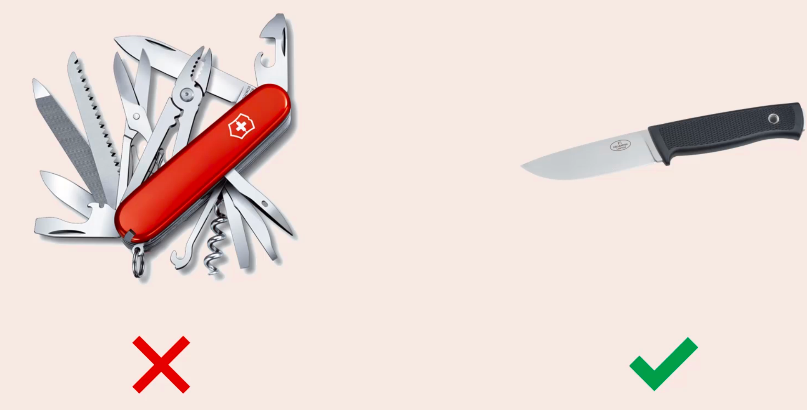
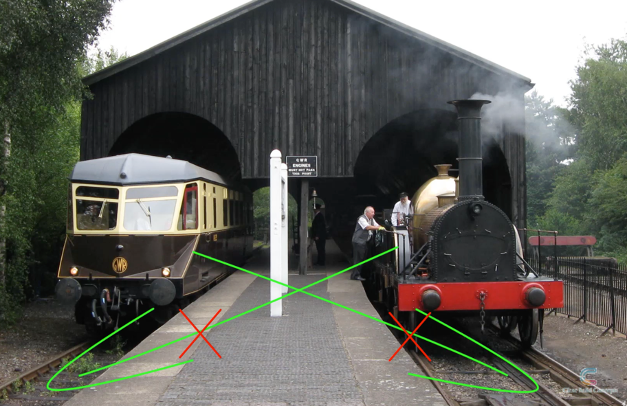
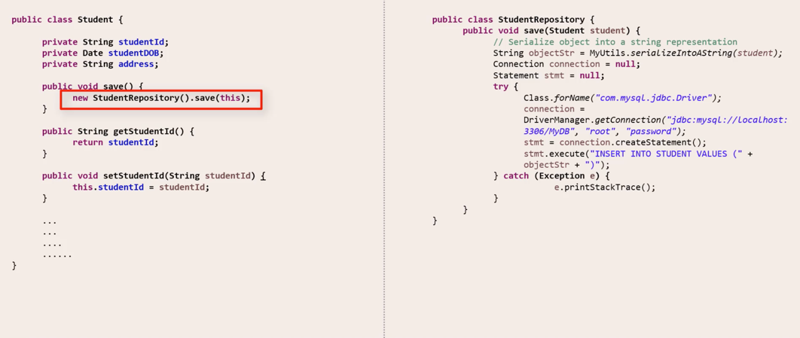
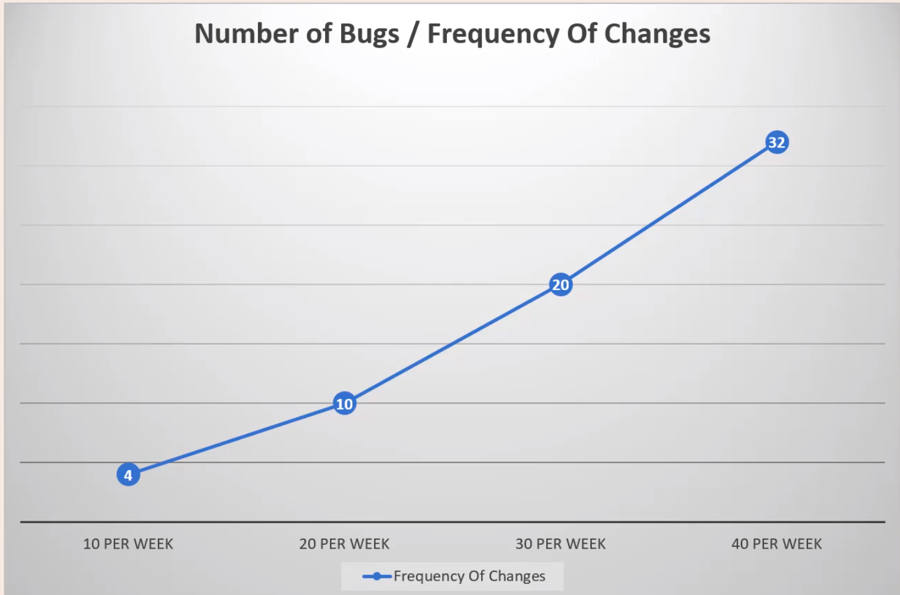
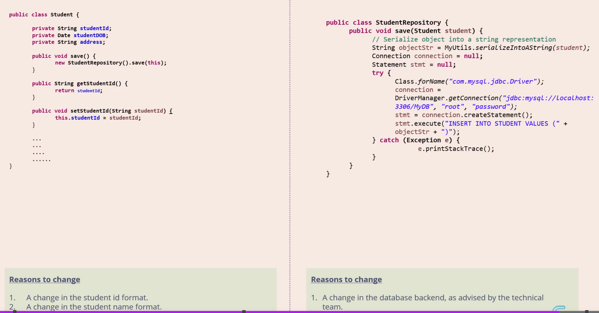

## Introduction 
S stands for Single Responsibility Principle, often abbreviated and referred to as SRP. <br>
So what is this principle?  <br>
The Single Responsibility Principle says that 'Every software  component should have one and only one responsibility'

When we say software component, if we are talking in the context of an object oriented programming language like Java, the first thing that comes to our mind is a Java class.

But it is to be noted that the term software component could also refer to a method or a function or even a module.

So the rule states that a software component should have only one responsibility.

Let me bring up a picture to explain this.


This is Swiss Army Knife. As you know,a swiss army knife is a combination of a number of useful tools, each one with a distinct purpose. <br>
You can have anything from a can opener to a pair of mini scissors or even a screw-driver inside a Swiss Army knife. <br>

Although a Swiss Army knife is a versatile tool and much sought after and appreciated, when it comes to software, the rules change. <br>

If you think of the Swiss Army Knife as a software component, it violates the Single Responsibility Principle, for the reason that it has multiple responsibilities. <br>

So then what does SRP recommend? <br>
If I can put a visual to it, this is it. <br>
 <br>
So this is a knife that has a single responsibility. <br>
It can only be used to cut. You cannot use it as a can opener, you cannot use it as a screw-driver, you can only use it to cut. <br>
This is a very high level introduction of the Single Responsibility Principle.  <br>

#### Cohesion
Take a look at this class.

``` 
public class Square {

    private boolean highResolutionMonitor = true;
    private int side = 5;

    public int calculateArea() {
        return side * side; // side² - side ^ 2;
    }

    public int calculatePerimeter() {
        return side * 4;
    }

    public void draw() {
        if (highResolutionMonitor) {
            // Render a high resolution image of a square
        } else {
            // Render a high normal image of a square
        }
    }

    public void rotate() {
        // Rotate the image of the square clockwise to
        // the required degree and re-render
    }
}
```
The name of the class is Square. 
It has 4 methods: 
-   calculateArea(),
-   calculatePerimeter()
-   draw()
-   rotate()

The _calculateArea_ and _calculatePerimeter_ functions do exactly what they are supposed to do, they calculate the area and perimeter of a square given the length of its side.

The _draw()_ function renders the image of the square on the display.  <br>
It has multiple code flow, depending on what type of display is being used.  <br>

The _rotate()_ function rotates the image of the square and re-renders it on the display.  <br>

In the context of this code snippet, we will learn about a new concept termed **Cohesion**.  <br>

Cohesion , in the software world is defined as the degree to which the various parts of a software component are related.  <br>

Here, you see garbage that looks unsegregated.  <br>

You cannot really come up with a relation between all the contents of this garbage can. It has a wide variety of items like plastic cans, beer bottles, paper waste etc.  <br>

But let's look at how it looks, after it gets segregated. Very nice.  <br>

  <br>

Take a look at the yellow bin for plastics.  <br>
There are a number of plastic bottles inside the bin.  <br>
The bottles are NOT alike.  <br>
But if you look at all the contents of the yellow bin, they have a common relation.  <br>
They are all made up of plastic.  <br>

If we apply the definition of cohesion here, which says that cohesion is the degree of relation, we could say that the contents of the unsegregated waste bin have a low cohesion, and the contents of each of the segregated waste bins have a high cohesion.  <br>

Let's get back to our code snippet and apply the same principle here.  <br>
What do you make of the methods inside the Square class?  <br>

The methods calculateArea and calculatePerimeter are closely related, in that they deal with the measurements of a square.  <br>
So there is a high level of cohesion between these two methods.  <br>

The draw() method and the rotate() method deal with rendering the image of the square in a certain way on the display.  <br>
So there is a high level of cohesion between these two methods as well.  <br>

But if you take all of the methods as a whole, the level of cohesion is low.  <br>
For instance , the calculatePerimeter() method is not closely related to the draw() method as they deal with entirely different responsibilities.  <br>

So we are going to do some shuffling so as to increase the level of cohesion.  <br>

We take these draw and rotate methods and move them to a different class - SquareUI.  <br>

By doing this, even though I have split the methods into two classes, I have increased the level of cohesion in each of the classes.  <br>

All the two methods inside the Square class are now closely related, as both of them deal with the measurements of the square.  <br>

All the two methods inside the SquareUI class are now closely related, as both of them deal with the graphic rendering of the square.  <br>

So one aspect of the Single Responsibility Principle is that, we should always aim for high cohesion within a component.  <br>
Component means class in this case.  <br>

If there is high cohesion between all methods of a class, we can assign a single responsibility to all the methods as a whole.  <br>
For e.g. for the first class Square, we can safely say that the responsibility of the Square class as a whole is to deal with the measurements related to a square.  <br>

Similarly , for the second class SquareUI, we can safely say that the responsibility of the SquareUI class as a whole is to deal with rendering the image of a square.  <br>

So we just saw how aiming for higher cohesion can help us move towards conforming to the single responsibility principle.  <br>

#### Coupling
Like cohesion, there is another concept that we need to look at - Coupling.  <br>
Coupling is defined as the level of inter-dependency between various software components.  <br>

Take a look at these two trains.  <br>
  <br>

What do you notice about the width of the tracks?  One is Standard Gauge Rail, and other is Broad Gauge Rail.  <br>
- Standard Gauge is 1.4 m wide.  <br>
- Broad Gauge is 1.6m wide.  <br>

The difference in width makes it two entirely different railway systems. For e.g. the width of the train for standard gauge is different from that of broad gauge. One train cannot move on a track of a different gauge. In other words, a train is tightly coupled to its track.  <br>

Tight coupling may be a necessity in railways, but in software, tight coupling is an undesirable feature.  <br>

Why? See below example -   <br>

So Coupling is defined as the level of inter-dependency between various software components.  <br>

Let's see a code snippet now.  <br>
Here's a class Student.  <br>

One of the methods inside the Student class is the save() method.  <br>
  <br>
The 'save' method will convert the student class into a serialized form and persist it into a Database.  <br>

You can see that this method deals with a lot of low level details related to handling record insertion into a database.  <br>

Let's assume the database you are using now is MySQL. Sometime in the future, if you decide to go with a NoSQL database like,say, MongoDB, most of this code will need to change.  <br>
So you can see that the Student class is tightly coupled with the database layer we use at the back end, just like the train is tightly coupled to the track.  <br>

The Student class should ideally deal with only basic student related functionalities like getting student id, date of birth, address etc.  <br>
The Student class should NOT be made cognizant of the low level details related to dealing with the back end database.  <br>
So tight coupling is bad in software.  <br>

So, How do we fix this?   <br>
We'll take the database related code, and we'll move it into a new Repository class.  <br>
Then we'll refer to this Repository method from inside the Student class.  <br>
By doing so, we have removed the tight coupling and made it loose.  <br>


So now if we change the underlying database, the Student class does NOT need to get changed and recompiled.  <br>
You only need to change the Repository class.  <br>
If you look at this in terms of responsibilities, the Student class has the responsibility of dealing with core student related data.  <br>
And the Repository class has a single responsibility of dealing with database operations.  <br>
So by removing tight coupling, and making the coupling loose, we are again abiding by the Single Responsibility principle.  <br>

So to sum up -
- we looked at two concepts - Cohesion and Coupling.
- We saw how low cohesion is bad.
- Single Responsibility Principle always advocates higher cohesion.
- We also saw how tight coupling is bad. Single Responsibility Principle always recommends loose coupling.
- So always aim for Higher Cohesion and Loose Coupling.


#### Reason for change : Single Responsibility Principle revisited
The principle ,that we studied so far, states that 'Every software component should have one and only one responsibility'  <br>
In place of the term responsibility, we are going to put a new phrase 'reason to change'.  <br>
So now it reads 'Every software component should have one and only one reason to change'.  <br>
So what's this new phrase 'reason to change'?  <br>
In the words of the Greek Philosopher - Heraclitus . "The only thing that is constant is change". In other words, change is inevitable.  <br>
This quote applies to the software world as well.  <br>

Software is never dormant. It always keeps changing.  <br>
Let us explain this with an example.  <br>

We'll start with the same Student class that we used for our previous session, the original version of it.  <br>

Assume that this Student class is part of a software module which is already in production.  <br>
There could be multiple reasons for a software component to change in the future -  <br>
- A change in the student id format, as suggested by school management.  <br>
- A change in the student name format, as necessitated by a state law.  <br>
- A change in the database back end, as advised by the technical team. Another one.  <br>

So, we have 3 reasons to change.  <br>
What does the Single Responsibility Principle say?  <br>
As per the new definition, 'Every software component should have one and only one ~~responsibility~~ reason to change'  <br>
Why? What's the problem if our class has more reasons to change?  <br>

If a software component has multiple reasons to change, then the frequency of changes to it will increase.  <br>
Every change to a software component opens up the possibility of introducing bugs into the software.  <br>
So if there are frequent changes to a software component, the probability of introducing a bug goes up.  <br>
This would require more time and effort to be spent on re-testing the software after the changes are made, because we need to make sure we catch all the bugs before we release the modified version of the software.  <br>
More time and effort, means more money.  <br>

  <br>

So the difference between following and not following the Single Responsibility Principle could be a considerable financial impact!  <br>
And this applies, not just to the Single Responsibility Principle, but to all other SOLID principles as well.  <br>

So, back to our code snippet...  <br>  <br>

How do we fix this? What can we do about the multiple reasons to change?  <br>
We'll repeat the same move we did in our last session.  <br>
We'll take the database operations out and move it to a separate Repository class.
Because we split the classes, lets split the 'reasons to change' as well.   <br>
So the Student class is left with 2 reasons to change.  <br>
And the Repository class has one reason to change.  <br>




2 is still a problem, isn't it. We are supposed to have only one reason to change, right?  <br>
Technically, yes. But if the reasons are closely related to one another,  you can go ahead and combine them.

So if we examine the 2 reasons to change for the Student class closely, one is related to student id, and another is related to student name.
We could combine both these and say 'changes to student profile'.  <br>

So now both our classes follow the new definition of the Single Responsibility Principle which says 'Every software component should have one and only one reason to change'  <br>
So this new definition which replaces Responsibility with Reason to Change is just a new perspective.  <br>
At the end of the day, the action which we took to fix is the same, in the previous session and the current session.  <br>
So, these two definitions are pretty much the same.  <br>