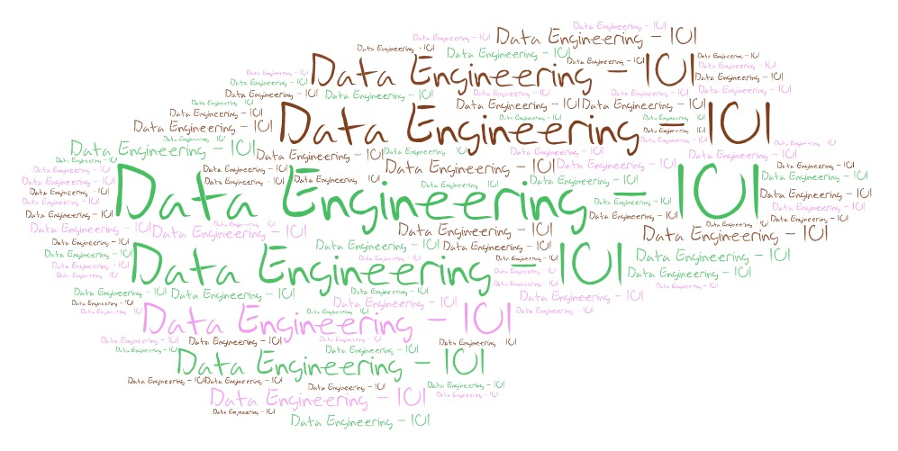

# Welcome to Data Engineering - 101

### Index
  - Concepts
    - [Data Warehousing Concepts](./SQL/docs/Data-Warehousing-basics.md)
    - [ELK](random/ELK Stack.md)
    - [Database Vs Datawarehouse Vs Datalake | ETL Vs ELT](random/ETL VS ELT.md)
  - OOPs concepts
    - [OOPs in Python](OOPs/OOPs in Python.md) 
  - SQL
      - [SQL Performance Tuning Page](./SQL/docs/sql_performance_tuning.md)
      - [SQL Performance Tuning Summary](./SQL/docs/sql_performance_tuning_summary.md)
      - [Common Table Expressions (CTEs)](SQL/docs/Common Table Expressions.md)
      - [SQL Analytical Functions](SQL/docs/sql-analytical-functions.md)
      - [SQL Practise Questions](SQL/docs/sql-practise-questions.md)
  - Storage Layer  
    - [Row-based Vs Column-based File Formats](Storage Layer Choices/row based and column based file formats.md)  
    - [Text-based File Formats](Storage Layer Choices/Text File Formats.md)  
    - [Big Data File Formats](Storage Layer Choices/big data file formats.md)  
    - [File Compression Techniques in Big Data Systems](Storage Layer Choices/File Compression techniques in Big Data.md) 
  - PyTest overview  
    - [PyTest overview](random/pytest.md)  
  - SOLID Principles  
    - [Introduction to SOLID Principles](SOLID Principles/Introduction.md)  
    - [Single Responsibility Principle](SOLID Principles/Single Responsibility Principle.md)  
    - [Open Closed Principle](SOLID Principles/Open Closed Principle.md)  
    - [Liskov Substitution Principle](SOLID Principles/Liskov Substitution Principle.md)  
    - [Interface Seggregation Principle](SOLID Principles/Interface Seggregation Principle.md)  
  - MLOps  
      - Challenges and Evolution of Machine Learning   
        - [Introduction to Machine Learning](MLOPs/1 - Challenges and Evolution of ML/1 - Introduction to ML.md)  
        - [Benefits of Machine Learning](MLOPs/1 - Challenges and Evolution of ML/2 - Benefits of ML.md)  
        - [MLOps Fundamentals](MLOPs/1 - Challenges and Evolution of ML/3 - MLOPs Fundamentals.md)  
        - [DevOps and DataOps Fundamentals](MLOPs/1 - Challenges and Evolution of ML/4 - DevOps and DataOps Fundamentals.md)  
      - MLOps Fundamentals   
        - [Problems that MLOps solves](MLOPs/2 - MLOps Fundamentals/ 1 - Problems that MLOps solves.md)  
        - [MLOps Components](MLOPs/2 - MLOps Fundamentals/2 - MLOps Components.md)  
        - [MLOps Toolbox](MLOPs/2 - MLOps Fundamentals/3 - MLOps Toolbox.md)  
      - MLOps Stages  
        - [MLOps Stages](MLOPs/3 - MLOps Stages/1 - MLOps Stages.md)
  - Productivity Hacks 
      - [Cold Mail Tactics](random/cold_mails.md) 
      - [LinkedIn Growth](random/LinkedIn growth.md) 
      - [Top 10 hacks to be a Bad developer](random/Top-10-hacks-to-be-a-Bad-Developer.md) 
      - [Jeff Bezos on Amazon Leadership principles](random/Amazon-Leadership-Principles-Jeff-Bezos-thought-process.md) 
      - [About Me](aboutme.md) 
  - New Rules of the Game  
    - [New Rules of the Game - an Introduction](New Rules of the game/Introduction.md) 
    - [New Rules of Work](New Rules of the game/New Rules of Working.md) 
    - [New Rules of Learning](New Rules of the game/New Rules of Working.md) 
    - [New Rules of Life](New Rules of the game/New Rules of Life.md) 
   
 **Author** : Kushal Luthra  