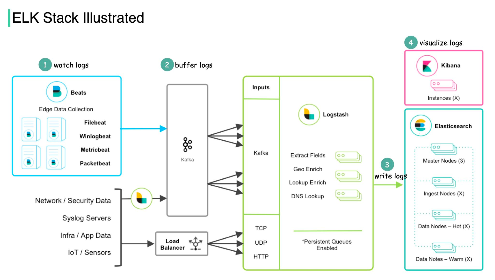

## What is ELK Stack and why is it so popular for log management?

The ELK Stack is composed of three open-source products.  

ELK stands for **Elasticsearch, Logstash, and Kibana.**   

🔹 Elasticsearch is a full-text search and analysis engine, leveraging Apache Lucene search engine as its core component.  

🔹 Logstash collects data from all kinds of edge collectors, then transforms that data and sends it to various destinations for further processing or visualization.  

In order to scale the edge data ingestion, a new product Beats is later developed as lightweight agents installed on edge hosts to collect and ship logs to Logstash.  

🔹 Kibana is a visualization layer with which users analyze and visualize the data.  

The diagram below shows how ELK Stack works:  
 

Step 1 - Beats collects data from various data sources. For example, Filebeat and Winlogbeat work with logs, and Packetbeat works with network traffic.  

Step 2 - Beats sends data to Logstash for aggregation and transformation. If we work with massive data, we can add a message queue (Kafka) to decouple the data producers and consumers.  

Step 3 - Logstash writes data into Elasticsearch for data indexing and storage.  

Step 4 - Kibana builds on top of Elasticsearch and provides users with various search tools and dashboards with which to visualize the data.  

ELK Stack is pretty convenient for troubleshooting and monitoring. It became popular by providing a simple and robust suite in the log analytics space, for a reasonable price.  

Credits : [Alex Wu](https://www.linkedin.com/in/alex-xu-a8131b11/)