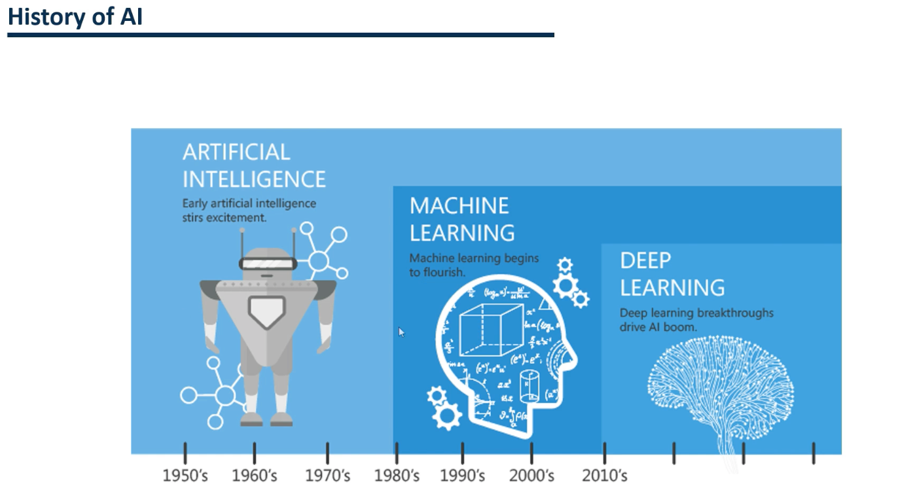
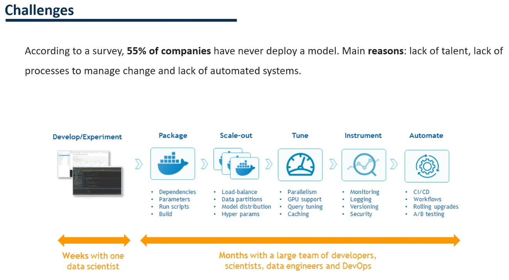
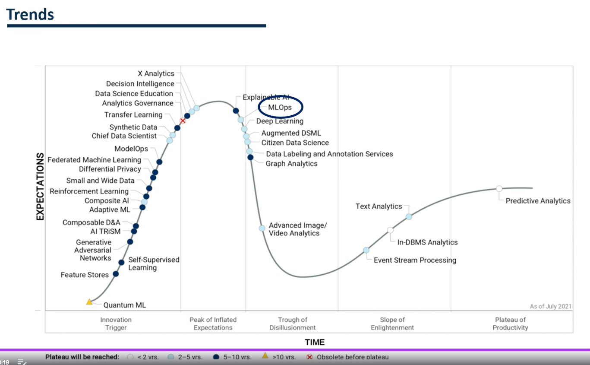

## Introduction to Machine Learning

As we already know, artificial intelligence has evolved considerably over the last few years.  
It started with the field of artificial intelligence in which the first more rudimentary artificial intelligence models were developed.  
It was between the 1950s-1980s, the field of machine learning emerged.  
That's when supervised and unsupervised learning machine learning models are developed.  
In addition, throughout these years is when machine learning gained strength and began to be applied.  
  
Finally, deep learning was developed in 2010.  
Deep learning is a type of machine learning that trains a computer to perform tasks as humans do.  
These tasks include speech recognition, image identification or video analysis.  
  
At this time, machine learning was booming and applied in different fields.  
However, during all these years, some challenges have persisted.  
  
  
  
According to a survey by algorithmic, 85% of models fail to deploy to production.  
- 55% of companies have never implemented a machine learning model.  
- These problems have caused 85% of machine learning projects to fail.  
  
Some main reasons are the lack of talent, the lack of processes that can manage change, and the absence of automated systems.  
It is well known that there is a shortage of people trained in this field.  
A single data scientist can take a few weeks to develop a model.  
However, putting the same model into production can take months of work for a team of developers.  
Why? Because model must be scalable, reproducible and collaborative to be deployed in production.  
  
You have to package the developments, establish the dependencies between the libraries, add parameters, execute scripts, and automate this process.  
It is also necessary to scale it so that it can meet the demands of users.   
To do this, you must add a load balancer, partition the data and adjust different model configurations.  
  
You also have to parallelize the model's training to support CPU, especially when we want to train the model with large amounts of data.  
  
Finally, you have to monitor the results and make a record.   
  
Thanks to this, we ensure that our model continues to work correctly over time.  
It is also necessary to generate different versions of the model.  
  
Finally, you have to automate the process.  
You have to create workflows and make it possible to update the models and many other transformations.  
  
How is all this done?  
Thanks to the MLOps and new trend has appeared in recent years.  
  

### MLOPs as an answer to challenges of ML
  
  

Here's Gartner's Trend Graph.  
This graph analyzes all the trends that have appeared related to the field of data.  
If we look closely at this curve, we can identify the trend of MLOps.  
  
MLOps was born to streamline the process of putting our machine learning models into production.  