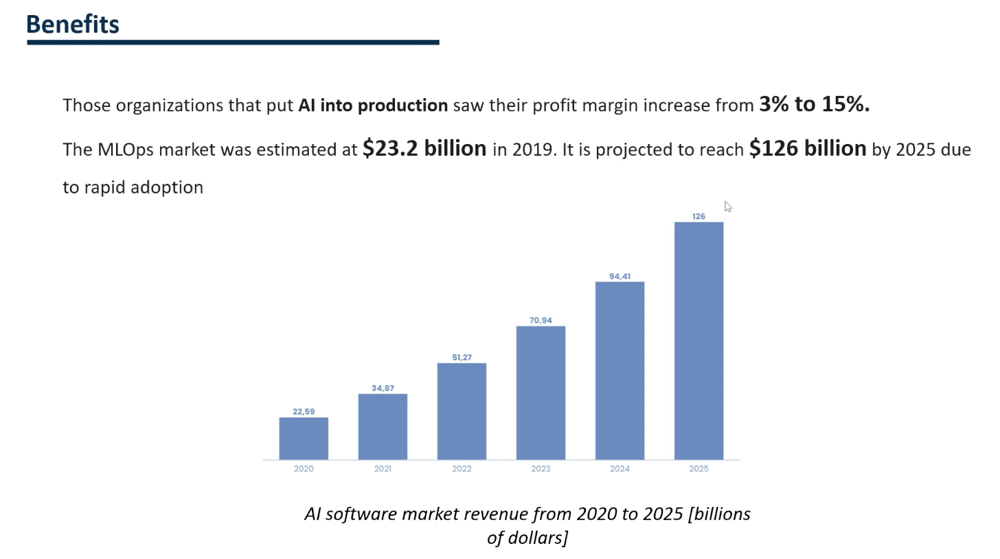

Despite the difficulties faced by machine learning, the benefits are considerable.  
According to multiple surveys, organizations that put machine learning models into production experienced a profit margin increase of 3 to 15%.  
  
  
  
Here we can see the evolution of this benefit.   
We see that around 2020 or 2019, the benefit was $23 billion.  
However, between 2024 and 2025, we will see an exponential increase in profit.  
It is due to the rapid adoption of machine learning that unlocks will enable.  